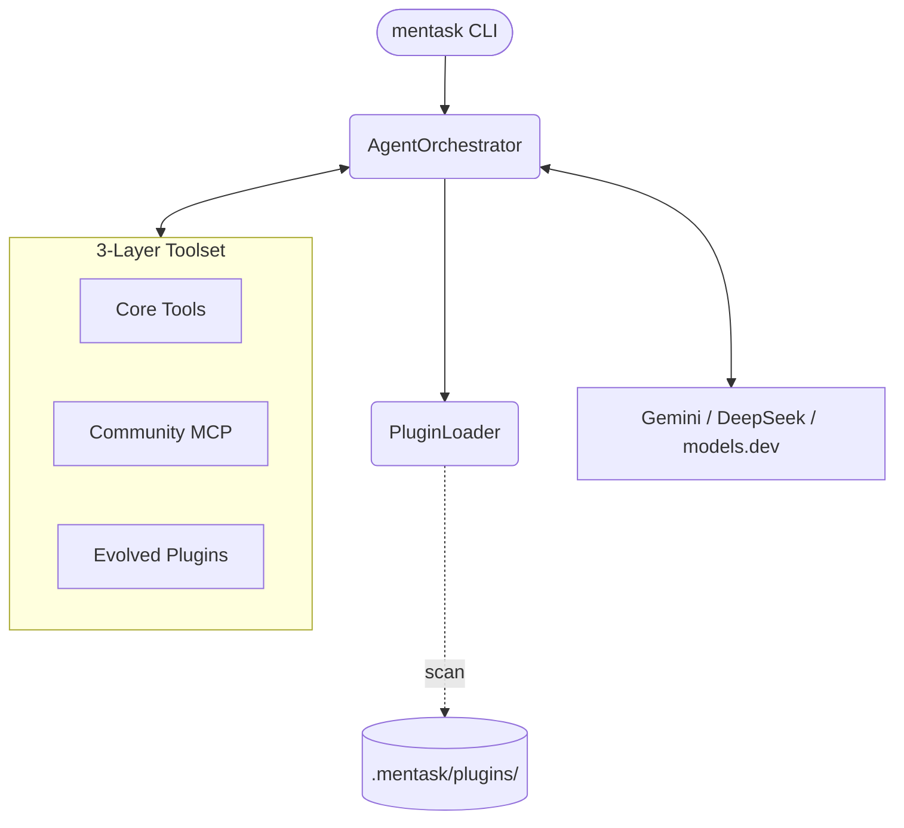

<p align="center">
  
</p>

<h1 align="center">mentask</h1>

<p align="center">
  <strong>Autonomous AI Coding Agent for the Terminal</strong>
</p>

<p align="center">
  <a href="https://pypi.org/project/mentask/"></a>
  <a href="https://www.python.org/downloads/"></a>
  <a href="LICENSE"></a>
  <a href="https://models.dev/"></a>
  <a href="https://github.com/astral-sh/ruff"></a><br>
  <a href="https://github.com/julesklord/mentask.py/actions/workflows/security.yml"></a>
  <a href="https://github.com/julesklord/mentask.py/actions/workflows/release.yml"></a>
</p>

---

**v0.20.0: THE SPICE MUST FLOW** | *Level 4 Autonomy: Self-Evolving Tooling Architecture*

---

**mentask** is a professional, autonomous coding agent designed for complex software engineering. Powered by an advanced asynchronous reasoning loop and a multi-layer orchestration engine, it doesn't just edit code — it **evolves** its own capabilities to match the specific needs of your codebase.

No GUI. No cloud sync. No bloat. Just a high-performance terminal agent with hardened security and autonomous tool-forging capabilities.

---

## What's New in v0.20.0: Level 4 Autonomy

The **"The Spice Must Flow"** update introduces a paradigm shift in AI agent capabilities: **Self-Evolving Tooling**. mentask is no longer limited by its pre-programmed toolset.

### 1. 3-Layer Plugin Architecture
A specialized hierarchy for total extensibility without compromising core stability:
- **Layer 1: Core Tools** (Native, Immutable) – The foundational "instincts" (File I/O, Shell, Security).
- **Layer 2: Community Plugins** (MCP) – Modular integrations with third-party services via the Model Context Protocol.
- **Layer 3: Autonomous Plugins** (Evolved) – Project-specific tools created and injected by the agent *on-the-fly* to solve repetitive tasks with native efficiency.

### 2. Autonomous "Forge" Capability (`forge_plugin`)
The agent can now architect, validate (via AST), and hot-reload its own Python modules. If a task requires repetitive specialized logic (e.g., massive audio demixing, complex CSV restructuring), mentask will **forge a native tool** to handle it, saving context tokens and increasing execution speed by orders of magnitude.

### 3. Persistent Hot-Reloading
New tools are saved to `.mentask/plugins/` and immediately available in the agent's schema without restarting the session. These tools persist across sessions and remain isolated from the core application source code.

---

## How it works

mentask operates via a **Thinking -> Action -> Observation** cycle managed by the `AgentOrchestrator`:

1. **Environmental Awareness**: Performs a recursive **Project Blueprint** scan to build a proactive system instruction.
2. **Cognitive Loop**: Processes intent using advanced multi-model providers (Gemini, DeepSeek, OpenAI).
3. **Tool Evolution**: If current tools are insufficient, the agent invokes the **Forge Engine** to expand its own capabilities.
4. **Security Centinel**: Every action passes through a **TrustManager** and **Safety Layer** (Path Traversal protection, MASS_DELETION guards).
5. **Atomic Execution**: File modifications use a temporary-write + rename strategy with automatic backups.

---

## Features

### Advanced Agentic Engine

| Feature | Description |
|---|---|
| **Self-Forging Tools** | Agent creates and hot-reloads its own Python plugins (`forge_plugin`). |
| **Autonomous Delegation** | Spawns specialized sub-agents (Explorer, Verifier) for parallel research. |
| **LSP Integration** | Real-time syntax verification and self-correction via Ruff LSP. |
| **Multimodal Intelligence** | Native analysis of images, audio, and video demos. |
| **Context Optimization** | Proactive "Context Snapping" (summarization) to manage long-turn sessions. |
| **MCP Support** | Connect to any external MCP server for database, cloud, or API tools. |

---

## Installation

### Prerequisites

- Python 3.10+
- A Google API Key (or OpenAI-compatible key for other models).

### From Source

```bash
git clone https://github.com/julesklord/mentask
cd mentask.py
pip install -e ".[dev]"
```

---

## Safety & Security

mentask implements a **Hardened Trust Model**:
- **Path Isolation**: The agent is restricted to whitelisted directories (`TrustManager`).
- **Risk Analysis**: Commands are categorized (`SAFE`, `NOTICE`, `WARNING`, `DANGEROUS`).
- **Critical Asset Protection**: Native protection for `.git`, `.env`, and lockfiles.
- **Atomic Writes**: Zero-risk file editing with automatic `.bkp` snapshots.

---

## Architecture



---

## Contributing

Licensed under the **MIT License**. Built with precision for the modern engineer.

Created by [julesklord](https://github.com/julesklord).
