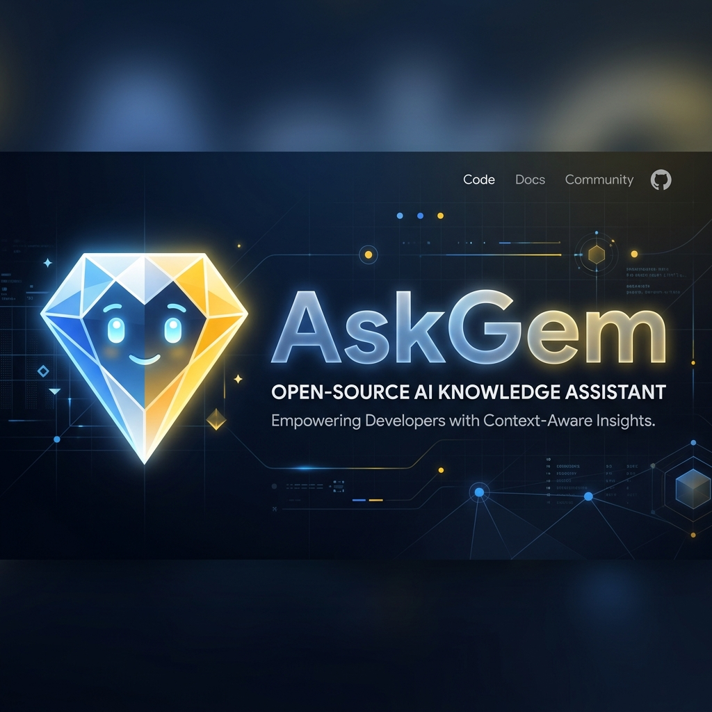

# askgem — Autonomous AI Coding Agent for the Terminal

[](https://www.python.org/downloads/)
[](LICENSE)
[](https://ai.google.dev/)
[](https://github.com/astral-sh/ruff)
[](https://github.com/julesklord/askgem.py/actions/workflows/security.yml)
[](https://github.com/julesklord/askgem.py/actions/workflows/release.yml)

**askgem** is a lightweight, autonomous coding agent that lives in your terminal.
Powered by Google Gemini, it reads your files, edits your code, runs shell commands,
and navigates your filesystem — all within an interactive session and with
proactive safety guardrails that keep you in control.

No GUI. No cloud sync. No bloat. Just a fast, opinionated CLI agent you can trust
with your codebase.



---

## Contents

- [How it works](#how-it-works)
- [Features](#features)
- [Installation](#installation)
- [Configuration](#configuration)
- [Usage](#usage)
- [Slash commands](#slash-commands)
- [Safety model](#safety-model)
- [Architecture](#architecture)
- [Development](#development)
- [Internationalization](#internationalization)
- [Roadmap](#roadmap)
- [Contributing](#contributing)
- [License](#license)

---

## How it works

askgem runs an asynchronous agentic loop powered by the `google-genai` SDK and a modular manager-based core. On each turn:

1. Your message is sent to the selected Gemini model with a set of dynamic system instructions.
2. The model reasons about the request and may call one or more tools (read a file,
   run a command, list a directory).
3. askgem intercepts those tool calls via a **ToolDispatcher**, executes them locally (subject to **Security Layer** checks), and feeds results back to the model.
4. The **StreamProcessor** handles the response, streamed to your terminal in real-time Markdown.
5. The full conversation is auto-saved to `~/.askgem/history/` after every turn by the **HistoryManager**.

This loop repeats until the model stops requesting tools or you exit the session.

---

## Features

### Modular Cognitive Core (v0.10.0)

- **SessionManager:** Robust API initialization and exponential backoff retry logic.
- **ContextManager:** Proactive summarization of long histories and dynamic system prompt assembly.
- **StreamProcessor:** High-speed response handling and tool extraction.
- **SimulationManager:** Deterministic playback and recording for reliable CI/CD testing.

### Agentic tool engine

| Tool | Description |
|---|---|
| `list_directory` | Explore filesystem trees with depth control |
| `read_file` | Read any file with optional line ranges — 30k char cap prevents token overflow |
| `edit_file` | Find-and-replace with **atomic writing**, uniqueness guard, and automatic `.bkp` backup |
| `execute_bash` | Run shell commands with 60s timeout and full **Risk Analysis** |
| `manage_memory` | Store and recall project facts across sessions |
| `manage_mission` | Track complex goals and sub-tasks via `heartbeat.md` |

### Human-in-the-loop safety

Every action is categorized by risk level (`SAFE`, `NOTICE`, `WARNING`, `DANGEROUS`).
Switch modes anytime mid-session:

- **`/mode manual`** (default) — approve each file edit and shell command.
- **`/mode auto`** — trust the agent fully; all actions execute without prompts.

### Modern TUI Dashboard

A stable "Push-Layout" Textual interface featuring real-time syntax highlighting, a reactive sidebar for stats and missions, and a command palette for autocomplete.

---
## Installation

### Prerequisites

- **Python 3.8+**
- A **Google API Key** — free at [Google AI Studio](https://aistudio.dev/)

### From source (recommended)

```bash
git clone https://github.com/julesklord/askgem.py
cd askgem.py
pip install -e ".[dev]"
```

---

## Configuration

### API key

askgem loads your key from these sources, in order:

1. **Environment variable** — `GEMINI_API_KEY=your_key askgem`
2. **System Keyring** — Secure storage via `keyring` (recommended)
3. **Saved file** — `~/.askgem/settings.json`

### Settings file

Stored at `~/.askgem/settings.json`:

```json
{
    "model_name": "gemini-1.5-flash",
    "edit_mode": "manual"
}
```

---

## Usage

Launch the agent:

```bash
askgem
```

Just type naturally:

```
You: refactor authenticate() in src/auth.py to use JWT instead of session tokens
You: find all TODO comments in the project and summarize them
You: create tests/test_auth.py with basic unit tests for the auth module
```

### Slash commands

| Command | Description |
|---|---|
| `/help` | Show the full command reference |
| `/model <name>` | Switch Gemini models mid-conversation |
| `/mode auto` | Execute edits and commands without confirmation |
| `/clear` | Reset the context window to free up tokens |
| `/usage` | Show session token count and estimated cost |
| `/stats` | Show detailed accomplishments summary |
| `/stop` | Interrupt current generation |
| `/reset` | Restart session and counters |

---

## Safety model

**Sandboxed Environment Safeguards:**
- **Path Traversal Protection:** All file operations strictly confined to the CWD via `core/security.py`.
- **Command Risk Analysis:** Automated pattern matching detects dangerous operations (rm -rf, etc.).
- **Atomic Writes:** `edit_file` uses temporary files + rename to prevent data corruption.
- **Rolling Context Window:** Prevents token budget overflow via proactive summarization.
- Every file edit creates a `.bkp` backup at `<original_path>.bkp`.
- Shell commands have a 60-second hard timeout.

---
## Architecture

```
askgem.py/
├── src/askgem/
│   ├── agent/
│   │   ├── chat.py              # Orchestrator
│   │   └── core/                # Managers (Session, Context, Stream, Command)
│   ├── cli/
│   │   ├── dashboard.py         # Textual TUI Dashboard
│   │   └── ui_adapters.py       # TUI/Rich bridging
│   ├── core/
│   │   ├── security.py          # Hardened safety engine
│   │   ├── config_manager.py    # Settings and Keyring
│   │   ├── i18n.py              # Translation engine (8 languages)
│   │   └── metrics.py           # Token tracking
│   ├── tools/                   # Atomic execution tools
│   └── locales/                 # i18n data
├── tests/                       # 39+ reliable tests (unit + integration)
└── pyproject.toml
```

---

## Development

### Automated Release

When a new version tag is pushed, the CD workflow automatically builds the package and creates a GitHub Release.

---

## License

GNU General Public License v3.0 — see [LICENSE](LICENSE) for full terms.

Built by [julesklord](https://github.com/julesklord).
