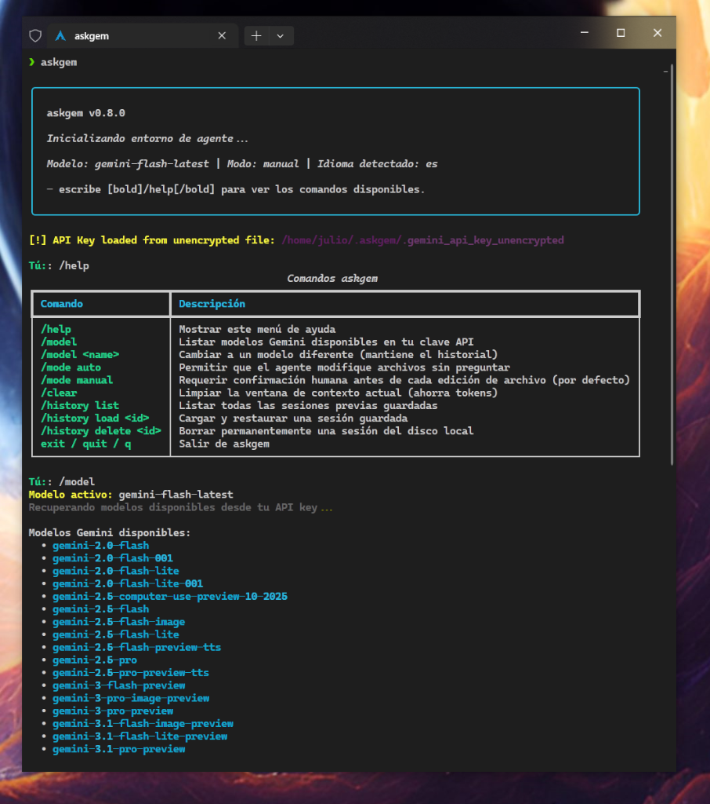

# askgem.py — Autonomous AI Coding Agent for the Terminal

[](https://www.python.org/downloads/)
[](LICENSE)
[](https://ai.google.dev/)

**askgem** is a powerful, autonomous command-line AI coding agent powered by Google's Gemini models. Reborn with the **Friendly Prism** identity, it features a premium Google Blue/Yellow interface designed for 2000s-style technical clarity.


## 📸 Preview

**askgem in action (screenshot)**  


---

## ✨ Key Features

- **Autonomous Agent:** Can read/edit files, run bash commands, and explore directories.
- **Human-in-the-Loop:** Optional confirmation prompts for all file/system actions.
- **Multi-Language:** Automatic or manual language detection (8 locales supported).
- **Token Economy:** Smart context window management with character-based limits.
- **Modern TUI:** Stylized `Rich` interface with real-time Markdown and status spinners.

### 🤖 Autonomous Agentic Engine

askgem integrates natively with `google-genai`, enabling multi-step reasoning and autonomous actions through registered tool functions:

- **`list_directory`** — Explore filesystem trees (capped at 100 items).
- **`read_file`** — Read source code with safety character truncated (30kb).
- **`edit_file`** — Precise find-and-replace code blocks with mandatory `.bkp` backups.
- **`diff_file`** — [NEW] Pre-auditing for proposed changes through unified diffs.
- **`grep_search`** — [NEW] Recursive text/regex searching across entire codebases.
- **`glob_find`** — [NEW] Recursive file discovery by filename patterns.
- **`execute_bash`** — Run shell commands with configurable timeout.

### 🛡️ Human-in-the-Loop Safety

A built-in guardrail system prompts for explicit `(Y/n)` confirmation before executing destructive actions. Toggle between modes:

- `/mode manual` — Approve every file edit and command execution (default).
- `/mode auto` — Trust the agent to operate autonomously.

### 🌍 Multi-Language Support (i18n)

askgem automatically detects your operating system locale. Currently supported: `en`, `es`, `fr`, `de`, `pt`, `it`, `ja`, `zh`.

---

## 📚 Documentation & Wiki

For detailed guides, please visit our **[GitHub Wiki](https://github.com/julesklord/askgem.py/wiki)** (also available locally in the `wiki/` folder):

- [Installation Guide](https://github.com/julesklord/askgem.py/wiki/Installation_and_Setup)
- [Command Reference](https://github.com/julesklord/askgem.py/wiki/Usage)
- [Architecture Deep-Dive](https://github.com/julesklord/askgem.py/wiki/Architecture)
- [Development Guide](https://github.com/julesklord/askgem.py/wiki/Development_Guide)

### 🔄 GitHub Wiki Sync

The `wiki/` folder is designed to be compatible with GitHub's native Wiki system. To synchronize them:

1. Clone your project's Wiki repository: `git clone https://github.com/julesklord/askgem.py.wiki.git`
2. Copy contents from `wiki/` to the wiki clone.
3. Commit and push: `git add . && git commit -m "Sync wiki" && git push origin master`

---

## 📦 Installation

### Prerequisites

- **Python 3.8** or higher
- A **Google Gemini API Key** — [Google AI Studio](https://aistudio.google.com/)

### Install from Source (Development)

```bash
git clone https://github.com/julesklord/askgem.git
cd askgem
pip install -e ".[dev]"
```

### Install directly via pip (v2.1.0)

```bash
pip install askgem
```

---

## 📖 Usage

Launch the interactive agent:

```bash
askgem
```

In-session commands start with `/`. Use `/help` for the full reference.

---

## 🗺️ Roadmap

See [ROADMAP.md](ROADMAP.md) for the full development roadmap.

- **v2.1** — Stability & Visual Rebirth (retry logic, `/undo`, `write_file`) [CURRENT]
- **v2.2** — Advanced code tools (`grep_search`, `glob_find`, `diff_file`)
- **v2.3** — Web research integration (Google Custom Search API)
- **v2.4** — Token economy & cost tracking
- **v2.5** — LSP integration (syntax-aware)

---

## 📝 License

This project is licensed under the **GNU General Public License v3 (GPLv3)**.
See the [LICENSE](LICENSE) file for details.

Built with ❤️ by [julesklord](mailto:julioglez@gmail.com).
