<p align="center">
  
</p>

# mentask

<p align="center">
  <strong>The Self-Evolving Autonomous Agent for Engineers Who loves to work with the cli (im talking tou you "btw i use arch" users)</strong>
</p>

<p align="center">
  <a href="https://pypi.org/project/mentask/"></a>
  <a href="https://www.python.org/downloads/"></a>
  <a href="LICENSE"></a>
  <a href="https://models.dev/"></a>
  <a href="https://github.com/astral-sh/ruff"></a>
</p>

---

## 🚀 Installation & Setup

mentask is designed to run locally with a minimal footprint.

### Prerequisites
- **Python:** 3.10+ (Tested up to 3.14)
- **API Key:** A valid Google Gemini API Key (or OpenAI/DeepSeek via models.dev).
- **System:** Standard OS commands (bash on UNIX, pwsh on Windows).

### Detailed Setup (Recommended)

For the best experience, clone the repository and install it in a virtual environment:

```bash
git clone https://github.com/julesklord/mentask
cd mentask

# Create and activate a virtual environment
python -m venv .venv
source .venv/bin/activate  # On Windows: .venv\Scripts\activate

# Install with development dependencies
pip install -e ".[dev]"
```

Alternatively, install directly from PyPI:
```bash
pip install mentask
```

### First Run & Configuration
Simply run the CLI in your project directory:
```bash
mentask
```
*Note: On the first run, mentask will prompt for your API key and securely store it in your OS\'s native secret service via `keyring` (Keychain/KWallet/Credential Manager). We don't store plain-text keys in configs.*

You can also bypass the prompt by exporting the key:
`export GEMINI_API_KEY="your-key-here"`

---

## 🙄 Why another AI coding agent?

Let's be honest. 90% of "AI agents" today are glorified chat wrappers. You paste an error, the AI hallucinates a function, you copy-paste it back, it fails, you paste the new error. It's a glorified clipboard exercise.

**mentask is fundamentally different.** It is a **Stateful Orchestrator** that lives in your terminal. It owns the execution loop. It reads the file, parses the AST, modifies the code, runs the linter, intercepts the traceback, and fixes its own mistakes before it even bothers to tell you it's done.

But more importantly: **it builds its own tools.**

---

## ⚡ v0.20.0: THE SPICE MUST FLOW (Level 4 Autonomy)

Most agents are limited by the tools their developers hardcoded into them. As of v0.20.0, mentask achieves **Level 4 Autonomy**: The ability to dynamically expand its own operational schema.

### 🛠️ The Autonomous Forge Engine
When mentask encounters a repetitive or highly specific engineering problem (e.g., "parse 50 CSVs, normalize the timestamps, and dump to sqlite"), it realizes that doing this via bash commands is inefficient. 

Instead, it invokes `forge_plugin`. 
1. **Synthesis**: The LLM writes a native Python module subclassing `BaseTool`, complete with Pydantic schemas for the arguments.
2. **AST Validation**: Before the code ever touches your disk, mentask runs `ast.parse()` to guarantee the syntax is valid Python. No `SyntaxError` crashes mid-loop.
3. **Hot-Reload Injection**: Using `importlib.util.module_from_spec`, the new tool is compiled and injected directly into the `ToolRegistry`'s memory space. 
4. **Execution**: The agent immediately calls its newly forged tool in the very next turn. 

The tool is saved to `.mentask/plugins/` and persists for your entire project lifecycle. You didn't write the tool. You didn't restart the agent. It just evolved.

---

## 🏗️ The 3-Tier Architecture (Under the Hood)

mentask isn't a monolith; it's a decoupled orchestration engine.

```mermaid
flowchart TD

subgraph group_entry["Entry"]
  node_run_py(("run.py<br/>entrypoint<br/>[run.py]"))
end

subgraph group_ui["CLI/UI"]
  node_cli_main["CLI main<br/>cli bootstrap<br/>[main.py]"]
  node_cli_renderer["Renderer<br/>ui render<br/>[renderer.py]"]
  node_cli_console["Console<br/>ui shell<br/>[console.py]"]
  node_tui_layout["Layout<br/>[layout.py]"]
  node_ui_interface["UI iface<br/>adapter<br/>[ui_interface.py]"]
end

subgraph group_agent["Agent"]
  node_orchestrator["Orchestrator<br/>agent loop<br/>[orchestrator.py]"]
  node_chat["Chat<br/>prompt flow<br/>[chat.py]"]
  node_schema["Schema<br/>[schema.py]"]
  node_commands["Commands<br/>[commands.py]"]
  node_session[("Session<br/>runtime state<br/>[session.py]")]
  node_context["Context<br/>[context.py]"]
  node_execution["Execution<br/>[execution.py]"]
  node_provider["Provider<br/>model gateway<br/>[provider.py]"]
  node_providers["LLM adapters<br/>model impls"]
  node_tools_registry["Tool registry<br/>tool dispatch<br/>[tools_registry.py]"]
  node_agent_tools["Agent tools<br/>tool contracts"]
end

subgraph group_core["Core State"]
  node_plugin_loader["Plugin loader<br/>extensibility<br/>[plugin_loader.py]"]
  node_mcp_manager["MCP manager<br/>integration hub<br/>[mcp_manager.py]"]
  node_security["Security<br/>policy<br/>[security.py]"]
  node_trust["Trust<br/>policy<br/>[trust_manager.py]"]
  node_paths["Paths<br/>state location<br/>[paths.py]"]
  node_config["Config<br/>[config_manager.py]"]
  node_history["History<br/>persistence<br/>[history_manager.py]"]
  node_memory["Memory<br/>persistence<br/>[memory_manager.py]"]
  node_tasks["Tasks<br/>workspace state<br/>[tasks_manager.py]"]
end

subgraph group_tools["Tools"]
  node_shell_tools["Shell tools<br/>local action<br/>[system_tools.py]"]
  node_file_tools["File tools<br/>workspace action<br/>[file_tools.py]"]
  node_search_tools["Search tools<br/>retrieval<br/>[search_tools.py]"]
  node_web_tools["Web tools<br/>remote action<br/>[web_tools.py]"]
  node_memory_tools["Memory tools<br/>state action<br/>[memory_tools.py]"]
  node_analysis_tools["Analysis<br/>[analysis_logic.py]"]
end

node_run_py -->|"starts"| node_cli_main
node_cli_main -->|"initializes"| node_cli_console
node_cli_main -->|"renders"| node_cli_renderer
node_cli_main -->|"lays out"| node_tui_layout
node_cli_main -->|"binds"| node_ui_interface
node_ui_interface -->|"drives"| node_orchestrator
node_orchestrator -->|"builds"| node_chat
node_orchestrator -->|"expects"| node_schema
node_orchestrator -->|"interprets"| node_commands
node_orchestrator -->|"updates"| node_session
node_orchestrator -->|"reads"| node_context
node_orchestrator -->|"tracks"| node_execution
node_orchestrator -->|"queries"| node_provider
node_provider -->|"delegates"| node_providers
node_orchestrator -->|"invokes"| node_tools_registry
node_tools_registry -->|"maps"| node_agent_tools
node_tools_registry -->|"extends"| node_plugin_loader
node_tools_registry -->|"bridges"| node_mcp_manager
node_agent_tools -->|"uses"| node_shell_tools
node_agent_tools -->|"uses"| node_file_tools
node_agent_tools -->|"uses"| node_search_tools
node_agent_tools -->|"uses"| node_web_tools
node_agent_tools -->|"uses"| node_memory_tools
node_agent_tools -->|"uses"| node_analysis_tools
node_file_tools -->|"guards"| node_security
node_shell_tools -->|"checks"| node_trust
node_file_tools -->|"resolves"| node_paths
node_config -->|"stores"| node_paths
node_history -->|"persists"| node_paths
node_memory -->|"persists"| node_paths
node_tasks -->|"persists"| node_paths
node_orchestrator -->|"enforces"| node_security
node_orchestrator -->|"enforces"| node_trust

click node_run_py "https://github.com/julesklord/mentask.py/blob/main/run.py"
click node_cli_main "https://github.com/julesklord/mentask.py/blob/main/src/mentask/cli/main.py"
click node_cli_renderer "https://github.com/julesklord/mentask.py/blob/main/src/mentask/cli/renderer.py"
click node_cli_console "https://github.com/julesklord/mentask.py/blob/main/src/mentask/cli/console.py"
click node_tui_layout "https://github.com/julesklord/mentask.py/blob/main/src/mentask/cli/tui/layout.py"
click node_ui_interface "https://github.com/julesklord/mentask.py/blob/main/src/mentask/agent/ui_interface.py"
click node_orchestrator "https://github.com/julesklord/mentask.py/blob/main/src/mentask/agent/orchestrator.py"
click node_chat "https://github.com/julesklord/mentask.py/blob/main/src/mentask/agent/chat.py"
click node_schema "https://github.com/julesklord/mentask.py/blob/main/src/mentask/agent/schema.py"
click node_commands "https://github.com/julesklord/mentask.py/blob/main/src/mentask/agent/core/commands.py"
click node_session "https://github.com/julesklord/mentask.py/blob/main/src/mentask/agent/core/session.py"
click node_context "https://github.com/julesklord/mentask.py/blob/main/src/mentask/agent/core/context.py"
click node_execution "https://github.com/julesklord/mentask.py/blob/main/src/mentask/agent/core/execution.py"
click node_provider "https://github.com/julesklord/mentask.py/blob/main/src/mentask/agent/core/provider.py"
click node_providers "https://github.com/julesklord/mentask.py/tree/main/src/mentask/agent/core/providers"
click node_tools_registry "https://github.com/julesklord/mentask.py/blob/main/src/mentask/agent/tools_registry.py"
click node_agent_tools "https://github.com/julesklord/mentask.py/tree/main/src/mentask/agent/tools"
click node_plugin_loader "https://github.com/julesklord/mentask.py/blob/main/src/mentask/core/plugin_loader.py"
click node_mcp_manager "https://github.com/julesklord/mentask.py/blob/main/src/mentask/core/mcp_manager.py"
click node_security "https://github.com/julesklord/mentask.py/blob/main/src/mentask/core/security.py"
click node_trust "https://github.com/julesklord/mentask.py/blob/main/src/mentask/core/trust_manager.py"
click node_paths "https://github.com/julesklord/mentask.py/blob/main/src/mentask/core/paths.py"
click node_config "https://github.com/julesklord/mentask.py/blob/main/src/mentask/core/config_manager.py"
click node_history "https://github.com/julesklord/mentask.py/blob/main/src/mentask/core/history_manager.py"
click node_memory "https://github.com/julesklord/mentask.py/blob/main/src/mentask/core/memory_manager.py"
click node_tasks "https://github.com/julesklord/mentask.py/blob/main/src/mentask/core/tasks_manager.py"
click node_shell_tools "https://github.com/julesklord/mentask.py/blob/main/src/mentask/tools/system_tools.py"
click node_file_tools "https://github.com/julesklord/mentask.py/blob/main/src/mentask/tools/file_tools.py"
click node_search_tools "https://github.com/julesklord/mentask.py/blob/main/src/mentask/tools/search_tools.py"
click node_web_tools "https://github.com/julesklord/mentask.py/blob/main/src/mentask/tools/web_tools.py"
click node_memory_tools "https://github.com/julesklord/mentask.py/blob/main/src/mentask/tools/memory_tools.py"
click node_analysis_tools "https://github.com/julesklord/mentask.py/blob/main/src/mentask/tools/analysis_logic.py"

classDef toneNeutral fill:#f8fafc,stroke:#334155,stroke-width:1.5px,color:#0f172a
classDef toneBlue fill:#dbeafe,stroke:#2563eb,stroke-width:1.5px,color:#172554
classDef toneAmber fill:#fef3c7,stroke:#d97706,stroke-width:1.5px,color:#78350f
classDef toneMint fill:#dcfce7,stroke:#16a34a,stroke-width:1.5px,color:#14532d
classDef toneRose fill:#ffe4e6,stroke:#e11d48,stroke-width:1.5px,color:#881337
classDef toneIndigo fill:#e0e7ff,stroke:#4f46e5,stroke-width:1.5px,color:#312e81
classDef toneTeal fill:#ccfbf1,stroke:#0f766e,stroke-width:1.5px,color:#134e4a
class node_run_py toneBlue
class node_cli_main,node_cli_renderer,node_cli_console,node_tui_layout,node_ui_interface toneAmber
class node_orchestrator,node_chat,node_schema,node_commands,node_session,node_context,node_execution,node_provider,node_providers,node_tools_registry,node_agent_tools toneMint
class node_plugin_loader,node_mcp_manager,node_security,node_trust,node_paths,node_config,node_history,node_memory,node_tasks toneRose
class node_shell_tools,node_file_tools,node_search_tools,node_web_tools,node_memory_tools,node_analysis_tools toneIndigo
```



### Module Breakdown (The Core Contracts)

We don't hide our internals. Here is exactly what runs when you launch mentask.

| Component | Path | Core Responsibility |
|:---|:---|:---|
| **The Heart** | `agent/orchestrator.py` | Central `Thinking -> Action -> Observation` loop. Uses ReAct prompting but optimized for system-level operations. |
| **The Snap** | `agent/core/context.py` | **Context Snapping**. When the token buffer hits 80%, it pauses execution, synthesizes history into a dense state representation, and flushes raw logs to save tokens. |
| **The Evolver** | `core/plugin_loader.py` | Handles dynamic `importlib` logic to inject new agent-forged tools into the registry at runtime. |
| **The Guard** | `core/trust_manager.py` | Whitelist-based security centinel. Validates if a path is within the workspace or explicitly trusted. |
| **The Linter** | `Ruff LSP (Background)` | Direct integration. Intercepts `E999` and `F821` diagnostics to initiate autonomous self-correction loops. |

---

## 🛡️ The Guard (Zero-Trust Security)

We know you're paranoid about an AI running `rm -rf /` or leaking your `.env`. We are too.

- **Strict Whitelisting (`TrustManager`)**: By default, mentask can only touch the directory it was launched in. Trying to access `/etc/` or `../other_project` throws a hard `SecurityError` unless explicitly authorized via `/trust`.
- **Canonical Path Traversal Guards**: It resolves all symlinks and strictly checks bounds. You can't trick it with `../../../`.
- **Atomic Operations**: File modifications use a `write-to-temp -> validate -> rename` strategy. Every mutation generates an automatic `.bkp` snapshot in `.mentask/history/`. If it breaks your code, just type `/undo`.
- **OS Keyring Integration**: API keys are stored in your OS's native secure enclave (Keychain/KWallet/SecretService).

---

## 📦 Dependency Footprint (Minimalist)

We hate bloat. mentask forces an extremely strict minimal dependency tree. No heavy ORMs, no web frameworks.

| Package | Purpose | Replaceable? |
|:---|:---|:---|
| `google-genai` | Fundamental API transaction protocols. | No. Direct platform wrapper. |
| `rich` | Low-level console formatting and styled TUI tables. | Highly difficult. |
| `keyring` | Secure OS-level storage for API keys. | Recommended for security standards. |

---

## ⌨️ TUI & Commands (Ditch the Mouse)

A premium, Rich-powered terminal UI that streams the agent's internal monologue.

| Command | Action |
|:---|:---|
| `/help` | Show all commands and current settings. |
| `/init` | Bootstrap your project. Creates the local `.mentask/` brain and SQLite history DB. |
| `/model <id>` | Hot-swap between Gemini 2.5 Pro, DeepSeek V3, or Claude 3.5 Sonnet mid-session. |
| `/mode [auto\|manual]` | Toggle between `manual` (ask before running tools) and `auto` (Jesus take the wheel). |
| `/trust [path]` | Authorize a directory for file operations. |
| `/artifacts` | List or expand agent-generated tool artifacts. |
| `/undo` | Rollback the AST state of the last modified file. |
| `/stats` | View token consumption, execution times, and estimated API costs in real-time. |
| `/sessions` | List recent sessions available to resume. |

---

## 🗺️ Roadmap: The God Emperor Era

- [x] **v0.18.0**: Lisan al-Gaib (Core Orchestrator, TrustManager, Multi-Provider)
- [x] **v0.20.0**: The Spice Must Flow (The Forge Engine, AST Validation, Hot-Reloading)
- [ ] **v0.21.0**: God Emperor (Semantic Vector Indexing for massive mono-repos, Distributed parallel sub-agents)

---

### Contributing
Licensed under the **MIT License**. 

Built with ❤️, excessive caffeine, and a deep hatred for manual refactoring by [julesklord](https://github.com/julesklord). If it breaks, open an issue. If it automates your job, buy me a beer.
