<p align="center">
  
</p>

# mentask

<p align="center">
  <strong>The Self-Evolving Autonomous Agent for Engineers Who love to work with the CLI<br/>(yes, i use Arch, why do you ask?)</strong>
</p>

<p align="center">
  <a href="https://pypi.org/project/mentask/"></a>
  <a href="https://www.python.org/downloads/"></a>
  <a href="LICENSE"></a>
  <a href="https://models.dev/"></a>
  <a href="https://github.com/astral-sh/ruff"></a>
</p>

---

## Installation & Setup

mentask is designed to run locally with a minimal footprint. No cloud nonsense, no vendor lock-in. Just you, your code, and an LLM with opinions.

### Prerequisites

- **Python:** 3.10+ (tested up to 3.14)
- **API Key:** A valid Google Gemini API key (or OpenAI/DeepSeek via models.dev)
- **System:** Standard OS commands available (`bash` on UNIX, `pwsh` on Windows)
- **RAM:** 4GB minimum, 8GB recommended (for the agent's working memory and token buffer)

### Setup (Recommended Path)

Clone and install in a virtual environment for isolation:

```bash
git clone https://github.com/julesklord/mentask
cd mentask

# Create and activate virtual environment
python -m venv .venv
source .venv/bin/activate  # On Windows: .venv\Scripts\activate

# Install with development dependencies
pip install -e ".[dev]"
```

**Fast Track (PyPI):**
```bash
pip install mentask
```

### First Run & Configuration

Launch mentask in your project directory:

```bash
mentask
```

On first run, you'll be prompted for your API key. mentask stores all provider keys securely in your OS's native secret service via `keyring`:
- **macOS:** Keychain
- **Linux:** SecretService (KWallet, Gnome Keyring)
- **Windows:** Credential Manager

Keys are **never written to disk in plaintext**. Your `.mentask/config.json` contains only metadata.

**Bypass the prompt with environment variables:**
```bash
export GEMINI_API_KEY="your-key-here"
export OPENAI_API_KEY="your-key-here"
export DEEPSEEK_API_KEY="your-key-here"
mentask
```

---

## Why mentask Exists

Let's be brutally honest. 90% of "AI agents" in the wild are glorified chat wrappers:
1. You paste an error
2. The AI hallucinates a function
3. You copy-paste it back
4. It breaks
5. You paste the new error
6. Repeat until your brain melts

This is not an agent. This is a clipboard exercise with extra steps.

**mentask is fundamentally different.** It's a **stateful orchestrator** that owns the entire execution loop:

- **It reads the file.** Parses the AST. Understands scope.
- **It modifies the code.** Injects fixes without breaking syntax.
- **It runs the linter.** Intercepts `E999` and `F821` diagnostics in real-time.
- **It executes the test.** Captures the traceback.
- **It fixes its own mistakes.** Before bothering to tell you it's done.

Most critically: **it builds its own tools.** When mentask encounters a repetitive engineering problem it can't solve efficiently with existing tools, it doesn't ask you. It synthesizes a new Python module, validates the AST, loads it hot into memory, and immediately uses it in the next turn. Your workflow evolves in place.

This isn't conversation. This is **autonomy**.

---

### The Autonomous Forge Engine

Scenario: You have 50 CSV files with inconsistent timestamp formats. You need to normalize them, deduplicate by ID, and dump the result into SQLite. A typical agent would write a bash one-liner. mentask recognizes this as inefficient and **invokes the Forge:**

1. **Synthesis**: The LLM introspects the problem, generates a Python module subclassing `BaseTool`, complete with Pydantic argument schemas and docstrings.

2. **Proactive AST Validation**: Before the code touches your disk, mentask runs `ast.parse()` to guarantee:
   - Syntax is valid Python
   - The module correctly implements `BaseTool`
   - All dependencies are already available
   - The method signatures match the contract

3. **Trust-Based Loading**: For your paranoia (justified), mentask only loads dynamic plugins from `.mentask/plugins/` if the current workspace has been explicitly `/trust`-ed. Global plugins bypass this; local plugins don't.

4. **Hot-Reload Injection**: Using `importlib.util.spec_from_loader`, the bytecode is compiled and the module is injected directly into the `ToolRegistry`'s memory space without restarting the agent.

5. **Immediate Execution**: The agent invokes its newly forged tool in the very next turn, as if it always existed.

6. **Persistence**: The tool is saved to `.mentask/plugins/` and remains available for the entire project lifecycle. You didn't write it. You didn't restart anything. The system just evolved.


---

## The 3-Tier Architecture (Under the Hood)

mentask isn't a monolith. It's a decoupled orchestration engine built on three independent layers that communicate through well-defined contracts.

```mermaid
flowchart TD

subgraph group_entry["Entry"]
  node_run_py(("run.py<br/>entrypoint<br/>[run.py]"))
end

subgraph group_ui["CLI/UI"]
  node_cli_main["CLI main<br/>cli bootstrap<br/>[main.py]"]
  node_cli_renderer["Renderer<br/>ui render<br/>[gem_renderer.py]"]
  node_cli_console["Console<br/>ui shell<br/>[console.py]"]
  node_tui_layout["Layout<br/>[layout.py]"]
  node_ui_interface["UI iface<br/>adapter<br/>[ui_interface.py]"]
end

subgraph group_agent["Agent"]
  node_orchestrator["Orchestrator<br/>agent loop<br/>[orchestrator.py]"]
  node_chat["Chat<br/>prompt flow<br/>[chat.py]"]
  node_schema["Schema<br/>[schema.py]"]
  node_commands["Commands<br/>[commands.py]"]
  node_session[("Session<br/>runtime state<br/>[session.py]")]
  node_context["Context<br/>[context.py]"]
  node_execution["Execution<br/>[execution.py]"]
  node_provider["Provider<br/>model gateway<br/>[provider.py]"]
  node_providers["LLM adapters<br/>model impls"]
  node_tools_registry["Tool registry<br/>tool dispatch<br/>[tools_registry.py]"]
  node_agent_tools["Agent tools<br/>tool contracts"]
end

subgraph group_core["Core State"]
  node_plugin_loader["Plugin loader<br/>extensibility<br/>[plugin_loader.py]"]
  node_mcp_manager["MCP manager<br/>integration hub<br/>[mcp_manager.py]"]
  node_security["Security<br/>policy<br/>[security.py]"]
  node_trust["Trust<br/>policy<br/>[trust_manager.py]"]
  node_paths["Paths<br/>state location<br/>[paths.py]"]
  node_config["Config<br/>[config_manager.py]"]
  node_history["History<br/>persistence<br/>[history_manager.py]"]
  node_memory["Memory<br/>persistence<br/>[memory_manager.py]"]
  node_tasks["Tasks<br/>workspace state<br/>[tasks_manager.py]"]
end

subgraph group_tools["Tools"]
  node_shell_tools["Shell tools<br/>local action<br/>[system_tools.py]"]
  node_file_tools["File tools<br/>ast ops<br/>[file_tools.py]"]
  node_search_tools["Search tools<br/>semantic<br/>[search_tools.py]"]
  node_web_tools["Web tools<br/>fetch/parse<br/>[web_tools.py]"]
  node_memory_tools["Memory tools<br/>embedding<br/>[memory_tools.py]"]
  node_analysis_tools["Analysis tools<br/>logic<br/>[analysis_logic.py]"]
end

node_run_py -->|"starts"| node_cli_main
node_cli_main -->|"renders"| node_cli_renderer
node_cli_main -->|"buffers"| node_cli_console
node_cli_renderer -->|"layout"| node_tui_layout
node_cli_main -->|"sends"| node_ui_interface
node_ui_interface -->|"notifies"| node_orchestrator
node_orchestrator -->|"reads/writes"| node_session
node_orchestrator -->|"manages"| node_context
node_orchestrator -->|"dispatches"| node_execution
node_orchestrator -->|"prompts"| node_chat
node_chat -->|"writes"| node_history
node_orchestrator -->|"queries"| node_provider
node_provider -->|"delegates"| node_providers
node_orchestrator -->|"invokes"| node_tools_registry
node_tools_registry -->|"maps"| node_agent_tools
node_tools_registry -->|"extends"| node_plugin_loader
node_tools_registry -->|"bridges"| node_mcp_manager
node_agent_tools -->|"uses"| node_shell_tools
node_agent_tools -->|"uses"| node_file_tools
node_agent_tools -->|"uses"| node_search_tools
node_agent_tools -->|"uses"| node_web_tools
node_agent_tools -->|"uses"| node_memory_tools
node_agent_tools -->|"uses"| node_analysis_tools
node_file_tools -->|"guards"| node_security
node_shell_tools -->|"checks"| node_trust
node_file_tools -->|"resolves"| node_paths
node_config -->|"stores"| node_paths
node_history -->|"persists"| node_paths
node_memory -->|"persists"| node_paths
node_tasks -->|"persists"| node_paths
node_orchestrator -->|"enforces"| node_security
node_orchestrator -->|"enforces"| node_trust

click node_run_py "https://github.com/julesklord/mentask.py/blob/main/run.py"
click node_cli_main "https://github.com/julesklord/mentask.py/blob/main/src/mentask/cli/main.py"
click node_cli_renderer "https://github.com/julesklord/mentask.py/blob/main/src/mentask/cli/gem_renderer.py"
click node_cli_console "https://github.com/julesklord/mentask.py/blob/main/src/mentask/cli/console.py"
click node_tui_layout "https://github.com/julesklord/mentask.py/blob/main/src/mentask/cli/tui/layout.py"
click node_ui_interface "https://github.com/julesklord/mentask.py/blob/main/src/mentask/agent/ui_interface.py"
click node_orchestrator "https://github.com/julesklord/mentask.py/blob/main/src/mentask/agent/orchestrator.py"
click node_chat "https://github.com/julesklord/mentask.py/blob/main/src/mentask/agent/chat.py"
click node_schema "https://github.com/julesklord/mentask.py/blob/main/src/mentask/agent/schema.py"
click node_commands "https://github.com/julesklord/mentask.py/blob/main/src/mentask/agent/core/commands.py"
click node_session "https://github.com/julesklord/mentask.py/blob/main/src/mentask/agent/core/session.py"
click node_context "https://github.com/julesklord/mentask.py/blob/main/src/mentask/agent/core/context.py"
click node_execution "https://github.com/julesklord/mentask.py/blob/main/src/mentask/agent/core/execution.py"
click node_provider "https://github.com/julesklord/mentask.py/blob/main/src/mentask/agent/core/provider.py"
click node_providers "https://github.com/julesklord/mentask.py/tree/main/src/mentask/agent/core/providers"
click node_tools_registry "https://github.com/julesklord/mentask.py/blob/main/src/mentask/agent/tools_registry.py"
click node_agent_tools "https://github.com/julesklord/mentask.py/tree/main/src/mentask/agent/tools"
click node_plugin_loader "https://github.com/julesklord/mentask.py/blob/main/src/mentask/core/plugin_loader.py"
click node_mcp_manager "https://github.com/julesklord/mentask.py/blob/main/src/mentask/core/mcp_manager.py"
click node_security "https://github.com/julesklord/mentask.py/blob/main/src/mentask/core/security.py"
click node_trust "https://github.com/julesklord/mentask.py/blob/main/src/mentask/core/trust_manager.py"
click node_paths "https://github.com/julesklord/mentask.py/blob/main/src/mentask/core/paths.py"
click node_config "https://github.com/julesklord/mentask.py/blob/main/src/mentask/core/config_manager.py"
click node_history "https://github.com/julesklord/mentask.py/blob/main/src/mentask/core/history_manager.py"
click node_memory "https://github.com/julesklord/mentask.py/blob/main/src/mentask/core/memory_manager.py"
click node_tasks "https://github.com/julesklord/mentask.py/blob/main/src/mentask/core/tasks_manager.py"
click node_shell_tools "https://github.com/julesklord/mentask.py/blob/main/src/mentask/tools/system_tools.py"
click node_file_tools "https://github.com/julesklord/mentask.py/blob/main/src/mentask/tools/file_tools.py"
click node_search_tools "https://github.com/julesklord/mentask.py/blob/main/src/mentask/tools/search_tools.py"
click node_web_tools "https://github.com/julesklord/mentask.py/blob/main/src/mentask/tools/web_tools.py"
click node_memory_tools "https://github.com/julesklord/mentask.py/blob/main/src/mentask/tools/memory_tools.py"
click node_analysis_tools "https://github.com/julesklord/mentask.py/blob/main/src/mentask/tools/analysis_logic.py"

classDef toneNeutral fill:#f8fafc,stroke:#334155,stroke-width:1.5px,color:#0f172a
classDef toneBlue fill:#dbeafe,stroke:#2563eb,stroke-width:1.5px,color:#172554
classDef toneAmber fill:#fef3c7,stroke:#d97706,stroke-width:1.5px,color:#78350f
classDef toneMint fill:#dcfce7,stroke:#16a34a,stroke-width:1.5px,color:#14532d
classDef toneRose fill:#ffe4e6,stroke:#e11d48,stroke-width:1.5px,color:#881337
classDef toneIndigo fill:#e0e7ff,stroke:#4f46e5,stroke-width:1.5px,color:#312e81
classDef toneTeal fill:#ccfbf1,stroke:#0f766e,stroke-width:1.5px,color:#134e4a
class node_run_py toneBlue
class node_cli_main,node_cli_renderer,node_cli_console,node_tui_layout,node_ui_interface toneAmber
class node_orchestrator,node_chat,node_schema,node_commands,node_session,node_context,node_execution,node_provider,node_providers,node_tools_registry,node_agent_tools toneMint
class node_plugin_loader,node_mcp_manager,node_security,node_trust,node_paths,node_config,node_history,node_memory,node_tasks toneRose
class node_shell_tools,node_file_tools,node_search_tools,node_web_tools,node_memory_tools,node_analysis_tools toneIndigo
```



### Module Breakdown (The Core Contracts)

We don't hide our guts. Here's exactly what runs when you launch mentask:

| Component | Path | Core Responsibility |
|:---|:---|:---|
| **Orchestrator** | `agent/orchestrator.py` | Central Think→Act→Observe loop. ReAct prompting optimized for system-level ops. No hallucinations, only tool invocations. |
| **Context Snapping** | `agent/core/context.py` | When the token buffer hits 80%, pauses execution, synthesizes history into a dense state representation, and flushes raw logs to save tokens. Prevents context explosion. |
| **Plugin Loader** | `core/plugin_loader.py` | Hot-injection of agent-forged tools into the registry using `importlib.util.spec_from_loader`. Only works in trusted workspaces. |
| **Trust Manager** | `core/trust_manager.py` | Whitelist-based security. Validates if a path is within the workspace or explicitly authorized. Blocks path traversal attacks. |
| **Ruff Integration** | Background LSP | Direct integration with Ruff's diagnostics. Intercepts `E999` (syntax errors) and `F821` (undefined names) to trigger autonomous self-correction loops. |
| **History Manager** | `core/history_manager.py` | SQLite-backed persistence of all execution traces. Every command, tool invocation, and output is logged. Enables session resumption and audit trails. |
| **Memory Manager** | `core/memory_manager.py` | Semantic indexing of past operations. Uses embeddings to surface relevant context when the agent needs to recall similar past tasks. |

---

## Advanced Workflows (Leveling Up)

### Workflow 1: Autonomous Multi-File Refactoring

You have 30 TypeScript files with inconsistent error handling. You want to:
1. Identify all `try-catch` blocks
2. Replace them with a custom error handler
3. Run the linter to verify syntax
4. Execute tests to validate behavior

Instead of running 30 separate CLI commands, you give mentask the task once:

```
> refactor the error handling in src/services/*.ts to use our custom ErrorBoundary
```

mentask will:
- Scan the files via AST analysis
- Detect patterns and dependencies
- Forge a `RefactorTool` to apply changes in batch
- Validate each file with `ruff check`
- Run your test suite automatically
- Report successes and failures

All autonomously. No per-file approval needed (if you're in `auto` mode).

### Workflow 2: Semantic Code Search Across Your Codebase

Need to find "all places where we're querying the user table but not filtering by organization_id"? This is hard for regex. mentask can:

1. Index your codebase with semantic embeddings
2. Embed your query
3. Find similar code blocks
4. Validate them against a Pydantic schema you define
5. Report matches with context

### Workflow 3: Plugin Development Workflow

You realize mentask needs a tool to batch-convert audio files using FFmpeg. You don't write it manually:

```
> create a tool that converts audio files in batch using ffmpeg, accepts input_dir, output_format, and bitrate
```

mentask will:
1. Generate the `BaseTool` subclass with proper Pydantic schemas
2. Validate the AST before writing to disk
3. Save it to `.mentask/plugins/`
4. Load it hot
5. Use it immediately

You now have a reusable audio batch conversion tool. Forever.

---

## The Guard (Zero-Trust Security)

We know you're paranoid. We are too.

### The Security Model

- **Strict Whitelisting (`TrustManager`)**: By default, mentask can only touch the directory it was launched in. Trying to access `/etc/passwd` or `../other_project/` throws a hard `SecurityError` unless you explicitly authorize it via `/trust /path/to/dir`.

- **Dynamic Plugin Isolation**: Plugins in `.mentask/plugins/` are only auto-loaded if the workspace has been `/trust`-ed. This prevents malicious code from auto-executing in untrusted repos cloned from GitHub.

- **Canonical Path Resolution**: All symlinks are resolved before validation. You can't trick the system with `../../../secret/file`. The agent walks the real filesystem.

- **Atomic File Operations**: File modifications follow a `write-to-temp` → `validate` → `rename` pattern. Every mutation generates an automatic `.bkp` snapshot in `.mentask/history/`. If a change breaks your code, just run `/undo` to restore the previous version.

- **OS Keyring Integration**: All API keys (Gemini, OpenAI, DeepSeek) are stored in your OS's native secure enclave:
  - **macOS:** Keychain
  - **Linux:** SecretService (GNOME Keyring / KWallet)
  - **Windows:** Credential Manager

  Keys **never appear in plaintext** in config files or logs.

- **Execution Sandboxing**: Tool invocations are wrapped in `subprocess` with resource limits. Long-running commands can be interrupted. Infinite loops are detected and killed.

---

## TUI & Commands (Ditch the Mouse)

A Rich-powered terminal interface that streams the agent's internal monologue in real-time. All interaction happens via keyboard commands.

### Command Reference

| Command | Syntax | Purpose |
|:---|:---|:---|
| **help** | `/help` | Show all commands and current settings. |
| **init** | `/init` | Bootstrap a new mentask project. Creates `.mentask/` directory and SQLite history DB. |
| **model** | `/model <id>` | Hot-swap between available models mid-session. Supported: `gemini-2-5-pro`, `deepseek-v3`, `claude-3-5-sonnet`. |
| **mode** | `/mode [auto\|manual]` | Toggle execution mode. `manual`: ask before running tools. `auto`: execute immediately. |
| **trust** | `/trust [path]` | Authorize a directory for file operations. Enables dynamic plugin loading in that path. |
| **untrust** | `/untrust [path]` | Revoke trust from a directory. |
| **artifacts** | `/artifacts [list\|expand]` | List or expand agent-generated tool artifacts. View source code of forged plugins. |
| **undo** | `/undo` | Rollback the AST state of the last modified file. Restores from `.mentask/history/`. |
| **redo** | `/redo` | Reapply the last undone change. |
| **stats** | `/stats` | Real-time view of token consumption, execution times, and estimated API costs. |
| **sessions** | `/sessions [list\|resume]` | List recent sessions. Resume a previous session to continue work. |
| **memory** | `/memory [search\|clear]` | Search the semantic memory index or clear it. |
| **clear** | `/clear` | Clear the current session history and start fresh. |
| **exit** | `/exit` or `Ctrl-C` | Gracefully shut down mentask. Persists session state. |

### Example Session

```
$ mentask
Welcome to mentask v0.20.0

/init
✓ Initialized .mentask/ directory
✓ Created SQLite history database
✓ Ready to go

> add a health check endpoint to the api server that returns {status: "ok"}
[THINK] Task: Add health endpoint. Need to find server entrypoint, identify routing framework, add endpoint.
[ACT]   Reading src/server.ts (AST parse)
[ACT]   Executing: ruff check src/server.ts
[OBSERVE] No syntax errors. Framework detected: Express.

[THINK] Express. Need to add app.get('/health', ...). Simple task.
[ACT]   Modifying src/server.ts (line 42 insertion)
[ACT]   Running tests: npm test
[OBSERVE] 2 new tests pass. 1 test fails (wrong status code expected).

[THINK] Test expects 200, we returned 201. Fixing return.
[ACT]   Modifying src/server.ts (line 45 update)
[ACT]   Running tests: npm test
[OBSERVE] All 47 tests pass.

✓ Task complete. Added GET /health endpoint. Returns {status: "ok"} with 200 status.

/stats
Tokens used this session: 4,203 / 1,000,000 (cost: ~$0.008)
Execution time: 12.3s
Tool invocations: 5
Files modified: 1

/exit
Session saved. Resume later with: mentask /resume
```

---

## Dependency Footprint (Minimalist)

We hate bloat. mentask enforces an extremely strict minimal dependency tree. No heavy ORMs, no web frameworks, no bloated build tools.

| Package | Version | Purpose | Replaceable? | Notes |
|:---|:---|:---|:---|:---|
| `google-genai` | ^1.0.0 | Fundamental API protocol for Gemini. | No (core dependency) | Direct platform wrapper. Controls all LLM interaction. |
| `rich` | ^13.0.0 | Low-level console formatting and TUI rendering. | Highly difficult | Enables colored output, progress bars, tables. No good replacement. |
| `keyring` | ^24.0.0 | Secure OS-level API key storage. | Recommended | Falls back to plaintext if unavailable (not recommended). |
| `pydantic` | ^2.0.0 | Runtime schema validation for tool arguments. | Difficult | Generates validation schemas and error messages. Core to plugin system. |
| `python-dotenv` | ^1.0.0 | Load `.env` files at startup. | Yes | Can be replaced with manual `os.getenv()` calls. Optional for advanced users. |

**No extra dependencies for:**
- Web frameworks (no FastAPI/Flask)
- ORMs (no SQLAlchemy/Tortoise)
- Async libraries (uses stdlib `asyncio`)
- Testing frameworks (tests use stdlib `unittest`)
- Heavy logging (uses stdlib `logging`)

Total dependency tree (including transitive): ~35 packages. A minimal agent should have a minimal footprint.

---

## FAQ & Troubleshooting

### Q: Is mentask safe to run on production code?

**A:** Define "safe." mentask is safer than you manually copy-pasting from Stack Overflow. Every file modification is atomic, versioned, and undoable. That said:

- Run in `/manual` mode for production code and review changes before committing
- Explicit `/trust` a repo only if you understand what the agent will do
- The `.bkp` snapshots let you rollback instantly
- Test suite integration gives you confidence

### Q: Can mentask modify files outside my project directory?

**A:** Only if you run `/trust /path/to/directory`. By default, it's confined to your working directory. This is intentional.

### Q: What happens if the API key expires?

**A:** mentask will throw an auth error. Update your key via:
```bash
keyring set mentask gemini_api_key
# Then paste your new key
```

Or export a new key and restart mentask.

### Q: Can I pause a long-running task?

**A:** Yes. Press `Ctrl-C` at any time. The current tool invocation will be interrupted, and you'll be returned to the prompt. Session state is preserved.

### Q: How much does it cost to run mentask?

**A:** Depends on your usage. Each interaction uses tokens. Typical refactoring task costs ~$0.01–$0.05. Run `/stats` to see real-time cost breakdowns. Context snapping keeps costs down by flushing old logs when the buffer hits 80%.

### Q: Can I use mentask offline?

**A:** No. It requires an API key and internet connection to an LLM provider. Fully offline agents are a future research problem.

### Q: Does mentask work on Windows?

**A:** Yes. We test on Windows 10/11 with PowerShell. Keyring integration uses Credential Manager. File paths are normalized automatically.

### Q: Can I integrate mentask with my custom tool?

**A:** Yes. Write a plugin that subclasses `BaseTool` and drop it in `.mentask/plugins/custom_tool.py`. The agent will discover and use it. Or, let the agent forge plugins dynamically when it needs them.

### Q: What if the agent forges a broken tool?

**A:** The AST validation should catch syntax errors before loading. If a tool breaks at runtime, the traceback is captured and the agent will iterate on the fix. You can also run `/undo` to remove the plugin and trigger a rewrite.

### Q: Can mentask write tests for my code?

**A:** Yes. Just ask:
```
> write unit tests for src/utils.ts using jest
```

The agent will generate test files, validate syntax, and run them. If tests fail, it will fix the implementation or the tests.

### Q: Is there a limit to how many tools mentask can forge?

**A:** No hard limit. Each tool is a separate `.py` file in `.mentask/plugins/`. Theoretically you could have hundreds. Practically, you'll have 5–10 domain-specific tools per project.

### Q: How does context snapping work?

**A:** When token usage hits 80% of the model's max (e.g., 80K for Gemini), mentask pauses, summarizes the conversation history into a dense JSON representation, and flushes raw logs. The new context becomes the starting point for the next turn. You lose verbose logs but keep essential state.

---

## Contributing

We accept contributions. Fork, branch, submit a PR. Code style is enforced via Ruff.

### Development Setup

```bash
git clone https://github.com/julesklord/mentask
cd mentask
python -m venv .venv
source .venv/bin/activate
pip install -e ".[dev]"

# Run tests
pytest tests/

# Format code
ruff format src/
ruff check src/

# Type check
mypy src/
```

### Contribution Guidelines

- Write tests for new features
- Follow PEP 8 (enforced by Ruff)
- Keep the dependency tree minimal
- Document all public APIs
- Update this README if you change behavior

---

## License & Attribution

Licensed under the **MIT License**. See `LICENSE` file for details.

Built with ❤️, excessive caffeine, and a deep hatred for manual refactoring by [julesklord](https://github.com/julesklord).

If mentask saves you hours of boring work, consider:
- ⭐ Starring the repo (costs nothing, means everything)
- 🍻 Buying the author a beer (if you meet in person)
- 🐛 Reporting bugs and edge cases (helps everyone)
- 🔧 Contributing improvements (the best feedback is code)

---

**Last updated:** May 2026
**Status:** Actively maintained
**Python support:** 3.10–3.14
**API Providers:** Gemini 2.5, Claude 3.5 Sonnet, DeepSeek V3
