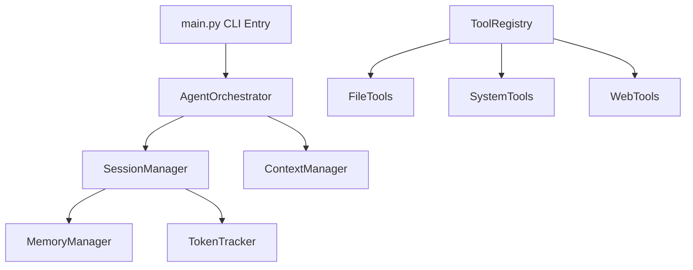

# mentask — Development Roadmap

> **Last Updated:** April 24, 2026
> **Current Version:** `0.19.0`
> **Maintainer:** [@julesklord](https://github.com/julesklord)
> **Status:** Milestone 8 (Water of Life) COMPLETED

This document outlines the engineering roadmap for `mentask`, organized into prioritized milestones. The current focus is resolving technical bugs, improving UX, and enhancing agent cognitive capabilities based on the latest v0.18.0 audit.

---

## Current State Assessment

### What mentask v0.17.4 Can Do Today

| Capability | Status | Description |
| :--- | :--- | :--- |
| **Multimodal Reasoning** | ✅ Shipped | Processes images, audio, and video via base64 encoding. |
| **On-Demand Knowledge** | ✅ Shipped | Optimized Knowledge Hub via `query_knowledge` tool. |
| **Autonomous Orchestration** | ✅ Shipped | Advanced Think -> Act -> Observe loop with 429 retry logic. |
| **TrustManager Security** | ✅ Shipped | Recursive directory validation and Path Traversal prevention. |
| **Web Research** | ✅ Shipped | Live internet search (Google/DDG) and content extraction. |
| **Full Validation** | ✅ Shipped | Broad unit/integration coverage across the core agent, tools, and CLI. |
| **Autonomous LSP** | ✅ Shipped | Real-time verification and self-correction via Ruff LSP. |
| **Professional TUI** | ✅ Shipped | Persistent Gem-style CLI renderer with committed buffer. |
| **Cognitive Tools** | ✅ Shipped | Working Memory and Plan Checkpointing for multi-turn sessions. |

### Architecture Diagram



---

## Milestone 1: Visual Identity and Stability (COMPLETED)

- [x] API Error Retry with Exponential Backoff
- [x] Dedicated `write_file` Tool
- [x] `/undo` Command (Restores `.bkp` snapshots)
- [x] Graceful Truncation of Oversized Context

## Milestone 2: Code Search Navigation (COMPLETED)

- [x] `grep_search` Tool (Pattern matching)
- [x] `glob_find` Tool (File discovery)
- [x] `diff_file` Tool (Unified diff previews)

## Milestone 3: Web Research Integration (COMPLETED)

- [x] `web_search` Tool (Google Search API integration)
- [x] `web_fetch` Tool (Markdown-friendly content extraction)

## Milestone 4: Architectural Sovereignty (COMPLETED)

- [x] Transition from Monolith to Specialized Managers
- [x] Pydantic integration for Agentturn schemas
- [x] Hierarchical Knowledge Hub (Standard/Global/Local)

---

## Milestone 5: Language Intelligence ("Bene Gesserit") (COMPLETED)

**Theme:** Transition from blind code editing to language-aware engineering.

### 5.1 LSP Client Bridge

- [x] Integration with Ruff via JSON-RPC.
- [x] Automated Lint-Fix Loop (Agent detects diagnostic and self-corrects).

### 5.2 Context Optimization

- [x] Semantic Truncation and proactive summarization.

---

## Milestone 7: Cognitive Architecture ("Lisan al-Gaib") (COMPLETED)

**Theme:** Robustness, memory persistence, and self-correcting logic.

### 7.1 Gem-Style Persistent Renderer

- [x] Full history retention in scroll buffer.
- [x] Incremental code and thought block commits.

### 7.2 Intelligence & Planning

- [x] `working_memory` for semantic inter-turn state.
- [x] `plan` tool for interactive `.mentask_plan.md` checkpoints.
- [x] Mandatory Self-Critique Reflection loop on tool errors.

### 7.3 Advanced UX & Safety

- [x] `/theme`, `/artifacts`, and `/undo` commands.
- [x] Automatic pre-edit backups and dynamic memory management.

---

## Milestone 6: Scalable Memory & Intelligence ("Shai-Hulud")

**Priority:** 🔴 High
**Estimated Effort:** Q2 2026
**Theme:** Transition to vector-based memory, deep code understanding, and autonomous engineering.

### 6.1 Vector Memory Integration

- [ ] Implement local RAG (Retrieval-Augmented Generation) for codebase indexing.
- [ ] Persistent project-level embeddings.

### 6.2 Multi-Agent Orchestration

- [x] Sub-agent spawning for parallel task execution (`delegate_mission`).

### 6.3 Deep Static Analysis & Refactoring

- [ ] Syntax-aware navigation (identifying classes, methods, and dependencies without full file reads).
- [ ] Intelligent Refactoring (safe renaming, method extraction, and dependency management).
- [ ] Detection of architectural pattern violations.

- [ ] Assisted conflict resolution and branch management.
- [ ] Automated pull request drafting and basic code reviews.

- [ ] Verification-first editing (generating tests before applying changes).
- [ ] CI/CD integration for automated test-fix loops.

---

## Milestone 8: Multi-Model Sovereignty ("MentAsk")
**Priority:** 🔴 CRITICAL
**Theme:** Breaking the Gemini-only barrier and evolving into MentAsk.

- [ ] **Universal Provider Architecture**: Abstraction of the LLM interaction layer.
- [ ] **OpenAI-Compatible Driver**: Support for DeepSeek, Groq, 302.AI, and more via standard API.
- [ ] **models.dev Dispatcher**: Automatic selection of provider and configuration based on model ID.
- [ ] **MentAsk Identity**: Gradual transition of branding and project identity.

---

## Version Release Timeline

```text
2026-04-19  v0.15.0  -  Kwisatz Haderach: LSP integration
2026-04-20  v0.16.0  -  The Golden Path: Professional Consolidation
2026-04-24  v0.18.0  -  Lisan al-Gaib: Cognitive Architecture
2026-04-26  v0.19.0  -  Water of Life: Universal Provider & MentAsk Vision (CURRENT)
```

---
*The code must be stable before the feature set expands.*
