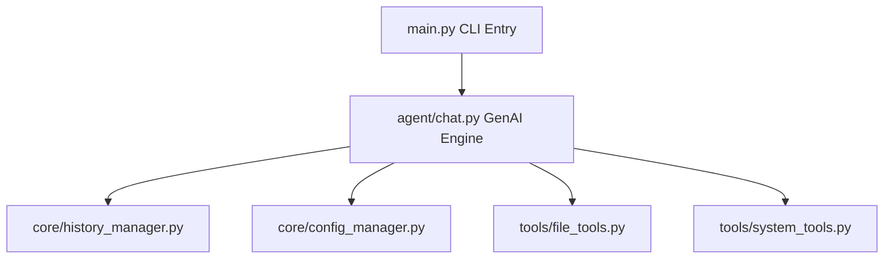
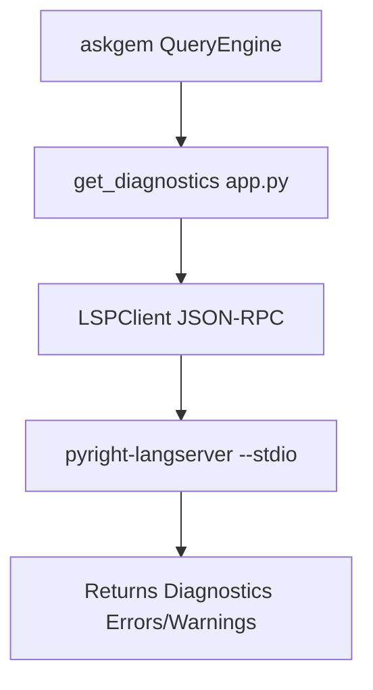

# askgem — Development Roadmap

> **Last Updated:** April 15, 2026
> **Current Version:** `0.13.0` ("Muad'Dib")
> **Maintainer:** [@julesklord](https://github.com/julesklord)
> **Status:** Active Development

This document outlines the comprehensive engineering roadmap for `askgem`, organized into prioritized milestones. Each milestone contains detailed technical specifications, acceptance criteria, and dependency mappings to guide development decisions.

---

## Table of Contents

1. [Current State Assessment](#current-state-assessment)
2. [Milestone 1: Visual Identity & Stability](#milestone-1---visual-identity-and-stability)
3. [Milestone 2: Code Search Navigation](#milestone-2)
4. [Milestone 3: Web Research Integration](#milestone-3)
5. [Milestone 4: Terminal Dashboard Overhaul](#milestone-4)
6. [Milestone 5: Language Intelligence](#milestone-5)
7. [Milestone 6: Plugin Ecosystem](#milestone-6)
8. [Technical Debt](#technical-debt)

---

## Current State Assessment

### What askgem v2.1 Can Do Today

| Capability | Module | Status |
| :--- | :--- | :--- |
| Interactive multi-turn chat with Gemini models | `agent/chat.py` | ✅ Shipped |
| Read files with line range support | `tools/file_tools.py::read_file` | ✅ Shipped |
| Edit files with find-and-replace + `.bkp` backups | `tools/file_tools.py::edit_file` | ✅ Shipped |
| Execute shell commands (bash) with 60s timeout | `tools/system_tools.py::execute_bash` | ✅ Shipped |
| List directory contents | `tools/system_tools.py::list_directory` | ✅ Shipped |
| Human-in-the-loop safety confirmations | `agent/chat.py` | ✅ Shipped |
| Model hot-swapping (`/model <name>`) | `cli/main.py` | ✅ Shipped |
| Rolling window context management | `core/history_manager.py` | ✅ Shipped |
| Session persistence and restore (`/history`) | `core/history_manager.py` | ✅ Shipped |
| OS-level locale auto-detection (8 languages) | `core/i18n.py` + `locales/*.json` | ✅ Shipped |
| Google Brand Identity (Blue/Yellow Theme) | `cli/console.py` + `cli/main.py` | ✅ Shipped |
| Animated Diamond Mascot & Multi-state behavior | `cli/dashboard.py` | ✅ Shipped |
| Professional TUI Dashboard with Debug Pane | `cli/dashboard.py` | ✅ Shipped |
| Advanced Web Research (Google/DuckDuckGo) | `tools/web_tools.py` | ✅ Shipped |
| Real-time Token & Cost Metrics engine | `core/metrics.py` | ✅ Shipped |
| 429 Retry Logic with backoff | `agent/chat.py` | ✅ Shipped |
| `write_file` and `grep_search` tools | `tools/*.py` | ✅ Shipped |

### Architecture Diagram



### Known Limitations in v2.0

1. **No retry logic on API errors** — A single `429 Resource Exhausted` or `500 Internal Server Error` from Gemini crashes the current turn with no automatic recovery.
2. **No search capabilities** — The agent cannot search inside files for patterns (grep) or find files by name glob.
3. **No internet access** — The agent cannot look up documentation, APIs, or package versions online.
4. **No cost awareness** — Users have zero visibility into how many tokens each conversation consumes or what it costs.
5. **No `write_file` tool** — Creating a new file requires using `edit_file` with empty `find_text`, which is semantically awkward and error-prone.
6. **Single-file editing only** — Cannot apply multi-file refactors atomically.
7. **No undo mechanism** — `.bkp` files exist but there's no `/undo` command to restore them.

---

## Milestone 1 - Visual Identity and Stability

**Priority:** 🔴 Critical
**Estimated Effort:** Completed
**Theme:** Establish a premium Google-inspired identity and bulletproof core logic.

### 1.1 API Error Retry with Exponential Backoff

**Problem:** Currently, a single `google.api_core.exceptions.ResourceExhausted` (HTTP 429) terminates the entire model turn. The user loses their input and must re-type it.

**Solution:** Implement a retry decorator in `engine/query_engine.py::_stream_response` with:

- Maximum 3 retry attempts
- Exponential backoff: 2s → 4s → 8s
- Jitter of ±500ms to avoid thundering herd
- Clear `rich.status.Status` feedback to the user during waits (e.g., "Rate limited, retrying in 4s...")
- Graceful fallback message after all retries exhausted

**Files Modified:**

- `engine/query_engine.py` (retry wrapper around `chat_session.send_message_stream`)
- `locales/*.json` (add `engine.retry`, `engine.retry_exhausted` keys)

**Acceptance Criteria:**

- [ ] A simulated 429 error triggers an automatic retry without user intervention
- [ ] The user sees a spinner with countdown during the backoff
- [ ] After 3 failures, a clean error message appears (not a Python traceback)

### 1.2 Dedicated `write_file` Tool

**Problem:** Creating new files currently requires passing an empty `find_text` to `edit_file`, which is unintuitive and has edge-case bugs when `os.path.dirname()` returns an empty string.

**Solution:** Extract new-file creation into a first-class `write_file(path, content)` tool.

**Files Created:**

- Extend `tools/file_tools.py` with `write_file()` function

**Files Modified:**

- `engine/query_engine.py` (register new tool, add dispatch case)
- `locales/*.json` (add `tool.wants_write` keys)

**Acceptance Criteria:**

- [ ] `write_file("new_folder/new_file.py", "print('hello')")` creates the file and all parent directories
- [ ] Human-in-the-loop confirmation is shown in manual mode
- [ ] Unit test covers creation, overwrite protection, and permission errors

### 1.3 `/undo` Command

**Problem:** Every `edit_file` call creates a `.bkp` backup, but users have no easy way to restore it.

**Solution:** Implement `/undo` slash command that restores the most recent `.bkp` file.

**Files Modified:**

- `engine/query_engine.py` (add `_cmd_undo`, track last edited path)
- `locales/*.json` (add `cmd.desc.undo`, `cmd.undo.success`, `cmd.undo.none` keys)

**Acceptance Criteria:**

- [ ] `/undo` restores the last modified file from its `.bkp` copy
- [ ] If no `.bkp` exists, a clean message is shown
- [ ] The undo action itself creates a recovery point

### 1.4 Graceful Handling of Oversized Context

**Problem:** If the rolling window still exceeds the model's context limit, the SDK throws an opaque `InvalidArgument` error.

**Solution:** Catch `InvalidArgument` in `_stream_response`, automatically truncate the oldest 50% of history, and retry once.

**Files Modified:**

- `engine/query_engine.py`
- `core/history_manager.py` (add `truncate_half()` method)

---

## Milestone 2

**Priority:** Completed
**Estimated Effort:** Shipped in v2.2
**Theme:** Give the agent the ability to search and navigate codebases like a human developer.

### 2.1 `grep_search` Tool (Pattern Matching)

**Problem:** The agent currently has no way to search for a string across multiple files. If asked "where is the `authenticate` function defined?", it must manually `list_directory` + `read_file` every single file — burning tokens and time.

**Solution:** Implement `grep_search(pattern, path, case_sensitive, is_regex)` that wraps Python's `pathlib.Path.rglob()` + line-by-line regex matching.

**Technical Details:**

- Recursively walk the directory tree, skipping `.git/`, `node_modules/`, `__pycache__/`, `.venv/`
- Return results as `file:line_number: matching_line` (capped at 50 results)
- Support both literal string and regex modes
- Binary file detection via null-byte check in first 8KB

**Files Created:**

- `tools/search_tools.py`

**Files Modified:**

- `agent/chat.py` (register tool, add dispatch)
- `locales/*.json` (add `tool.grep_search` keys)

**Acceptance Criteria:**

- [x] `grep_search("def authenticate", "src/")` returns file paths and line numbers
- [x] Results are capped at 50 to prevent token overflow
- [x] Binary files are skipped silently
- [x] Unit tests cover recursive search, regex mode, empty results

### 2.2 `glob_find` Tool (File Discovery)

**Problem:** The agent cannot find files by name pattern (e.g., "find all `.yaml` files in the project").

**Solution:** Implement `glob_find(pattern, path)` using `pathlib.Path.rglob()`.

**Files Created:**

- `tools/search_tools.py` (Add `glob_find`)

**Acceptance Criteria:**

- [x] `glob_find("*.py", "src/")` returns all Python files
- [x] Results exclude `.git/`, `node_modules/`, `__pycache__/`

### 2.3 `diff_file` Tool (Change Preview)

**Problem:** The agent applies edits blindly. There's no way for the user to see a unified diff of what changed.

**Solution:** Implement `diff_file(path)` that compares a file against its `.bkp` version using Python's `difflib.unified_diff`.

**Files Created:**

- Add to `tools/file_tools.py`

- [x] Shows a colored unified diff in the terminal
- [x] Returns "No changes detected" if file matches backup
- [x] Works for new file creation previews

---

## Milestone 3

**Priority:** Completed
**Estimated Effort:** Shipped in v2.3.0
**Theme:** Connect the agent to the live internet for documentation lookups.

### 3.1 `web_search` Tool (Google Custom Search API)

**Problem:** The agent has zero access to external information. When asked about a library it wasn't trained on, it can only hallucinate.

**Solution:** Integrate the [Google Custom Search JSON API](https://developers.google.com/custom-search/v1/overview) as a registered tool.

**Configuration Requirements:**

- `GOOGLE_SEARCH_API_KEY` — stored in `~/.askgem/settings.json` or environment variable
- `GOOGLE_CX_ID` — Programmable Search Engine ID

**Technical Details:**

- HTTP requests via `urllib.request` (zero new dependencies)
- Returns top 5 results: title, URL, snippet
- Rate limit: 100 queries/day on free tier

**Files Created:**

- `tools/web_tools.py`

**Files Modified:**

- `engine/query_engine.py` (register tool, add dispatch, add config prompts)
- `core/config_manager.py` (add search API key fields)
- `locales/*.json` (add `tool.web_search.*` keys)

**Acceptance Criteria:**

- [x] `web_search("python asyncio tutorial")` returns 5 titled results with URLs
- [x] Missing API key triggers a friendly setup wizard (Fallback to DuckDuckGo)
- [x] Rate limit errors are caught and surfaced cleanly
- [x] No new pip dependencies required

### 3.2 `web_fetch` Tool (Page Content Extraction)

**Problem:** Even with search results, the agent can't read the actual page content.

**Solution:** Implement `web_fetch(url)` that downloads a page and extracts readable text.

**Technical Details:**

- Use `urllib.request.urlopen` with a 10s timeout
- Strip HTML tags using a lightweight regex-based cleaner (avoid `beautifulsoup4` dependency)
- Truncate output to 4000 characters to prevent token explosion
- Support `text/plain`, `text/html`, and `application/json` content types

**Files Created:**

- Add to `tools/web_tools.py`

**Acceptance Criteria:**

- [x] `web_fetch("https://docs.python.org/3/library/os.html")` returns readable text
- [x] Binary/media URLs return a clean error message
- [x] Output is capped at 4000 characters with a truncation notice

---

## Milestone 4

**Priority:** 🔴 High (UI Overhaul)

**Estimated Effort:** 3-4 weeks

**Theme:** Transition from a linear chat to a professional, multi-pane "Terminal Dashboard."

### 4.1 The Terminal Console Evolution

**Problem:** The current scrolling terminal is functional but lacks "at-a-glance" observability. Users can't see the file tree, active context, or token metrics alongside the chat without scrolling.

**Solution:** Completely renovate the UI into a comprehensive **Command Dashboard** using the [Textual](https://textual.textualize.io/) framework.

**Key Features:**

- **Dashboard Layout**:
  - **Header**: Persistent branding (The Friendly Prism) + Active Model + Project Path.
  - **Left Sidebar**: Interactive Chat History + "Active Files" context list.
  - **Main Area**: Rich-formatted chat with **Expandable Activity Cards** (integrating tool logs and reasoning).
  - **Right Sidebar (Optional)**: Live system stats / Token usage.
  - **Footer**: Command/Input area + Real-time Cost/Token counters.

**Technical Details:**

- **Framework**: `textual` for the app engine + `rich` for content rendering.
- **Components**: Custom widgets for `ChatLog`, `ToolExecutionCard`, and `MetricBar`.
- **Event-Driven**: Move the `ChatAgent` loop to a background task to keep the UI responsive during long-running tool executions.

### Progress Tracking

- [x] **Milestone 4.1: Asynchronous TUI Foundation (v2.2.0)**
  - [x] Refactor `ChatAgent` to use `google-genai` AsyncClient.
  - [x] Implement multi-pane Dashboard (`AskGemDashboard`).
  - [x] Support legacy CLI mode via `--legacy` flag.
  - [x] Integrated friendly mascot and Google identity theme in TUI.

- [ ] **Milestone 5: Visionary Terminal Experience**
  - [ ] **Integrated File Browser**: Navigate and open files directly within the dash.
  - [ ] **Code Previewer**: Syntax-highlighted view of current files and proposed diffs.
  - [ ] **Real-time Stream**: Dedicated pane for real-time tool logs and bash output.
  - [ ] **Session Tab**: Seamlessly switch between active and archived histories.
  - [ ] **Memory Inspection**: Visualizing the current context window tokens and model state.
  - [ ] **Hotkey-driven Workflow**: Shortcuts for model switching and mode toggling.
  - [ ] **Custom Theme support**: Premium aesthetics with adaptive color palettes.

- [ ] **Milestone 4.2: Built-in Metrics & Cost Tracker**
  - [ ] Token usage updates in the footer with every response.
  - [ ] Tool executions render as interactive cards with progress logs.

- **Milestone 4.3: Cognitive Memory & Hub Hierarchy ("Muad'Dib")**
  - [x] Hierarchical KnowledgeManager (Standard, Global, Local).
  - [x] Extraction of system directives to Markdown hub.
  - [x] Proactive tool discovery directives.
  - [x] Shipped in **v0.13.0**.

- **Milestone 4.4: Hub Enrichment ("Bene Gesserit")**
  - [ ] Refinement of System Instructions (Persona -> Rules -> Guardrails).
  - [ ] Operational protocols for Conversational Loops.
  - [ ] Master Tool Use guidelines.
  - [ ] Planned for **v0.14.0**.

### 4.4: Local-First Autonomy & Private Server

**Priority:** 🔴 High (Urgent)
**Theme:** Decouple AskGem from pure Cloud APIs by implementing a local-first architecture.
**Reference:** Inspired by `OpenClaw` and decentralized local network implementations.

**Key Features:**

- **`askgem --server`**: Start a local API server (FastAPI) that exposes AskGem's core capabilities.
- **LocalModelAdapter**: First-class support for **Ollama**, **vLLM**, and **LM Studio** as model backends.
- **Local Network Networking**: Auto-discovery of other AskGem instances on the same subnet for shared memory.
- **Completely Offline Mode**: Allow full usage without an Internet connection (requires local LLM).

**Acceptance Criteria:**

- [ ] Agent can switch context between a local Ollama instance and Google Gemini.
- [ ] Multiple CLI clients can connect to a single headless AskGem server.
- [ ] Latency and connectivity metrics for local vs cloud.

---

## Milestone 5

**Priority:** 🔵 Low (High Complexity)
**Estimated Effort:** 3-4 weeks
**Theme:** Give the agent language-aware code intelligence.

### 5.1 LSP Client Bridge

**Problem:** The agent modifies code blindly — it has no way to verify syntax correctness, resolve imports, or check for type errors before submitting a change.

**Solution:** Implement a synchronous LSP client that communicates with local Language Servers via JSON-RPC over stdio.

**Technical Details:**

- Spawn a language server subprocess (e.g., `pyright-langserver --stdio`)
- Implement the LSP initialization handshake (`initialize` → `initialized`)
- Support `textDocument/didOpen`, `textDocument/didChange`, `textDocument/publishDiagnostics`
- Expose as `get_diagnostics(file_path)` tool to the Gemini agent

**Architecture:**



**Risk Assessment:**

- **High complexity:** JSON-RPC framing (Content-Length headers), async notification handling
- **Mitigation:** Keep it strictly synchronous and read-only (no completions, no refactoring — diagnostics only)
- **Dependency:** Requires the user to have a compatible language server installed

**Files Created:**

- `core/lsp_server.py` [NEW] (Base server loop)

**Acceptance Criteria:**

- [ ] `get_diagnostics("test.py")` returns syntax errors from Pyright
- [ ] Graceful fallback if no language server is installed
- [ ] Timeout protection (5s max per diagnostic request)

---

## Milestone 6

**Priority:** ⚪ Future
**Estimated Effort:** 4-6 weeks
**Theme:** Allow community-contributed tools without modifying core code.

### 6.1 Plugin Loader Architecture

**Problem:** Adding new tools currently requires modifying `query_engine.py` directly. This doesn't scale for community contributions.

**Solution:** Implement a plugin discovery system that loads tools from a `~/.askgem/plugins/` directory.

**Technical Details:**

- Each plugin is a Python file with a `register(engine)` function
- The function receives the engine instance and can call `engine.register_tool(func)`
- Plugins are loaded at startup via `importlib`
- A `plugin.json` manifest declares the plugin name, version, and tool descriptions

**Files Created:**

- `core/plugin_loader.py`

### 6.2 Built-in Plugin: Git Integration

**Problem:** The agent has no native git awareness.

**Solution:** Create a bundled plugin providing `git_status()`, `git_diff()`, `git_log(n)`, and `git_commit(message)` tools.

**Files Created:**

- `plugins/git_tools.py`

---

## Technical Debt

These items should be addressed continuously alongside milestone work:

| Item | Priority | Description |
| :--- | :--- | :--- |
| **Test Coverage** | High | Current: 38 tests covering config, file tools, system tools. Missing: query engine integration tests, i18n tests, history manager edge cases. Target: 80%+ coverage. |
| **Type Hints** | Medium | Add `py.typed` marker and complete `mypy` strict compliance across all modules. |
| **CI/CD Pipeline** | Medium | Set up GitHub Actions workflow: `ruff check` → `pytest` → `python -m build` on every PR. |
| **PyPI Publishing** | Medium | Automate `twine upload` via GitHub Actions on tag push (e.g., `v2.1.0`). |
| **Docstrings** | Low | Ensure every public function has Google-style docstrings with Args/Returns/Raises. |
| **Windows Terminal Encoding** | Low | Handle `cp1252` / `utf-8` mismatches in `execute_bash` output on legacy Windows consoles. |
| **Configuration Validation** | Low | Add JSON Schema validation for `settings.json` to catch corrupted config files early. |

---

## Non-Goals (Explicitly Out of Scope)

The following features are **intentionally excluded** from this roadmap to maintain focus and realistic scope for a solo maintainer:

| Feature | Reason |
| :--- | :--- |
| **Multi-agent orchestration** | Requires a full process management layer, IPC, and debugging infrastructure that is impractical for a single developer to maintain reliably. |
| **Voice input/output** | Hardware-dependent, requires microphone access and speech recognition SDKs. |
| **GUI / Electron wrapper** | askgem is a terminal-first tool by design. GUI development is an entirely separate project. |
| **Cross-model support (OpenAI, Anthropic)** | Would fragment the codebase with SDK-specific adapters. askgem is purpose-built for Google Gemini. |
| **Notebook (.ipynb) editing** | Jupyter notebook JSON structure is complex and error-prone. Users should use Jupyter directly. |
| **MCP server hosting** | Acting as an MCP server (not client) requires persistent TCP socket management, auth flows, and schema negotiation beyond current scope. |
| **Real-time collaboration** | Multi-user sessions would require a server component. Out of scope for a CLI tool. |

---

## Version Release Timeline (Estimated)

```text
2026-04-02  v0.11.0  ████      Visual Rebirth
2026-04-15  v0.13.0  ████████  Muad'Dib: Knowledge Hub (CURRENT)
2026-05     v0.14.0  ░░░       Bene Gesserit: Optimization
2026-Q3     v0.15.0  ░░        LSP Integration
```

> **Note:** This timeline assumes a single maintainer working part-time. Dates will shift based on community feedback and real-world usage patterns from the v2.0 release.

---

*This roadmap is a living document. It will be updated as priorities shift based on user feedback, bug reports, and community contributions.*
