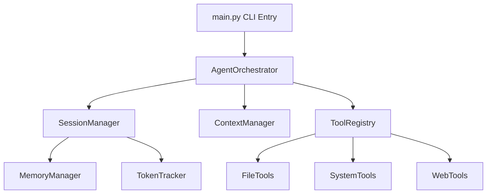

# askgem — Development Roadmap

> **Last Updated:** April 16, 2026
> **Current Version:** `0.13.4`
> **Maintainer:** [@julesklord](https://github.com/julesklord)
> **Status:** Active stabilization

This document outlines the engineering roadmap for `askgem`, organized into prioritized milestones. The current focus is tightening reliability, documentation coherence, and language-aware editing on top of the existing autonomous core.

---

## Current State Assessment

### What askgem v0.13.4 Can Do Today

| Capability | Status | Description |
| :--- | :--- | :--- |
| **Multimodal Reasoning** | ✅ Shipped | Processes images, audio, and video via base64 encoding. |
| **Hierarchical Hub** | ✅ Shipped | Context management across Standard, Global, and Local scopes. |
| **Autonomous Orchestration** | ✅ Shipped | Advanced Think -> Act -> Observe loop with 429 retry logic. |
| **TrustManager Security** | ✅ Shipped | Recursive directory validation and Path Traversal prevention. |
| **Web Research** | ✅ Shipped | Live internet search (Google/DDG) and content extraction. |
| **Full Validation** | ✅ Shipped | Broad unit/integration coverage across the core agent, tools, and CLI. |
| **Unified Pydantic Core** | ✅ Shipped | Type-safe communication between managers and tools. |
| **Terminal Renderer** | ✅ Shipped | Rich-based streaming CLI with inline confirmations and audit views. |

### Architecture Diagram



---

## Milestone 1: Visual Identity and Stability (COMPLETED)
- [x] API Error Retry with Exponential Backoff
- [x] Dedicated `write_file` Tool
- [x] `/undo` Command (Restores `.bkp` snapshots)
- [x] Graceful Truncation of Oversized Context

## Milestone 2: Code Search Navigation (COMPLETED)
- [x] `grep_search` Tool (Pattern matching)
- [x] `glob_find` Tool (File discovery)
- [x] `diff_file` Tool (Unified diff previews)

## Milestone 3: Web Research Integration (COMPLETED)
- [x] `web_search` Tool (Google Search API integration)
- [x] `web_fetch` Tool (Markdown-friendly content extraction)

## Milestone 4: Architectural Sovereignty (COMPLETED)
- [x] Transition from Monolith to Specialized Managers
- [x] Pydantic integration for Agentturn schemas
- [x] Hierarchical Knowledge Hub (Standard/Global/Local)

---

## Milestone 5: Language Intelligence ("Bene Gesserit")

**Priority:** 🔴 High
**Estimated Effort:** Q2 2026
**Theme:** Transition from blind code editing to language-aware engineering.

### 5.1 LSP Client Bridge
- **Goal:** Implement a light-weight LSP client to verify syntax and imports before applying edits.
- [ ] Integration with `pyright` and `tsserver` via JSON-RPC.
- [ ] Automated Lint-Fix Loop (Agent detects diagnostic and self-corrects).

### 5.2 Context Optimization
- **Goal:** Intelligent pruning of context window based on relevance rather than age.
- [ ] Semantic Truncation (Keep relevant imports and function signatures).

---

## Technical Debt & Maintenance

| Item | Priority | Status |
| :--- | :--- | :--- |
| **Translation Parity** | High | ✅ Solved in v0.13.2 (8 locales synchronized). |
| **Docs Consistency** | High | In progress; remove stale dashboard/TUI references and align docs with runtime behavior. |
| **CLI Contract Tests** | High | In progress; entrypoint tests aligned with current `--list` and default startup flow. |
| **Type Hinting** | Low | Partially complete; move toward stricter typing in orchestration and tool layers. |

---

## Version Release Timeline

```text
2026-04-14  v0.10.0  ████      The Modular Jump
2026-04-15  v0.13.0  ████████  Muad'Dib: Pydantic Core
2026-04-16  v0.13.4  ████████  CLI alignment and LSP hardening (CURRENT)
2026-05     v0.14.0  ░░░       Bene Gesserit: Optimization & LSP
```

---
*The code must be stable before the feature set expands.*
