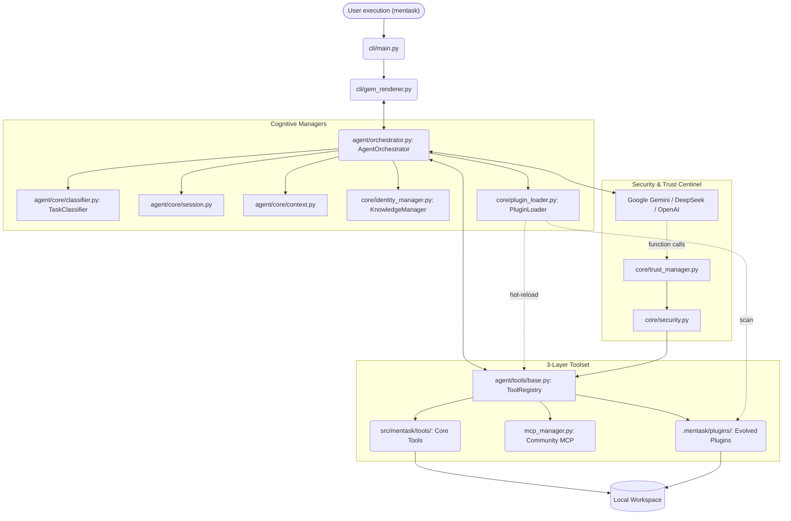

# Architecture

The system operates across three tightly decoupled layers enforcing strong logical boundaries. As of version **0.20.0 (The Spice Must Flow)**, the system has evolved into a **Self-Evolving Orchestrated Architecture**, where the agent can autonomously expand its own toolset via dynamic plugins.

## High-Level System Diagram

## Module Breakdown

1. `src/mentask/cli/` **(Presentation Layer)**

   - `gem_renderer.py`: **[Authoritative]** Persistent Gem-style renderer with incremental buffer commits and artifact expansion.

2. `src/mentask/agent/` **(Orchestration Layer)**

   - `orchestrator.py`: **\[The Heart\]** Central loop managing the *Thinking -> Action -> Observation* cycle. Includes **Stall Detection** logic that forces a strategy reset if the agent repeats explanations without calling tools.
   - `core/classifier.py`: **\[The Scout\]** Classifies user prompts into **Engineering Levels (L0-L3)** before execution starts, setting the "mindset" (Pragmatic vs. Architect) of the session.
   - `tools/plugin_tools.py`: **\[The Forge\]** Contains `ForgePluginTool`, which allows the agent to write and register new Python tools.

3. `src/mentask/core/` **(Safety & Evolution Layer)**

   - `plugin_loader.py`: **\[The Evolver\]** Handles dynamic `importlib` logic to inject new tools into the registry at runtime. **Enforces trust boundary.**
   - `security.py`: **\[The Guard\]** Validates paths and commands. Specifically tuned to allow agent-forged modifications in the `plugins/` directory.
   - `paths.py`: Resolves hierarchical paths for global config, local workspaces, and the new plugin incubator.

## Execution Flow (v0.27.2 Pragmatic)

1. **Environmental Boot**: `cli/main.py` initializes the environment.
2. **Pre-flight Classification**: `TaskClassifier` analyzes the user prompt and assigns an **Engineering Level (L0, L1, L2, or L3)**. This modifies the `system_instruction` to prioritize speed (L1) or rigor (L3).
3. **Dynamic Discovery**: `PluginLoader` scans the local and global plugin directories and injects any `BaseTool` subclasses into the `ToolRegistry`. **Local plugins require workspace trust.**
4. **Cognitive Loop**: The LLM reasons about the task. The orchestrator monitors for loops or stagnation (Stall Detection).
5. **Pragmatic Fallback**: If specialized tools (like `write_file`) fail due to complexity, the orchestrator instructs the agent to fallback to direct shell commands (`run_shell_command`).
6. **Autonomous Forging**: If the LLM identifies a repetitive or specialized task, it uses `forge_plugin` to architect a new native tool.
7. **Hot-Reload**: The `PluginLoader` immediately instantiates and registers the new tool, making it available for the next turn in the same session.

## Key Design Decisions

- **Level 4 Autonomy**: The agent is no longer a static consumer of tools; it is an active producer of engineering specialized plugins.
- **Separation of Concerns**: Core tools remain immutable. Evolved tools are isolated in `.mentask/plugins/` to prevent source code pollution and merge conflicts during updates.
- **Verification-First Forging**: The Forge engine uses `ast.parse` to validate the syntax AND structure of generated plugins before commitment.
- **Trust-Based Loading**: Dynamic code execution is gated by the `TrustManager` to prevent malicious plugins from being loaded from untrusted repositories.
