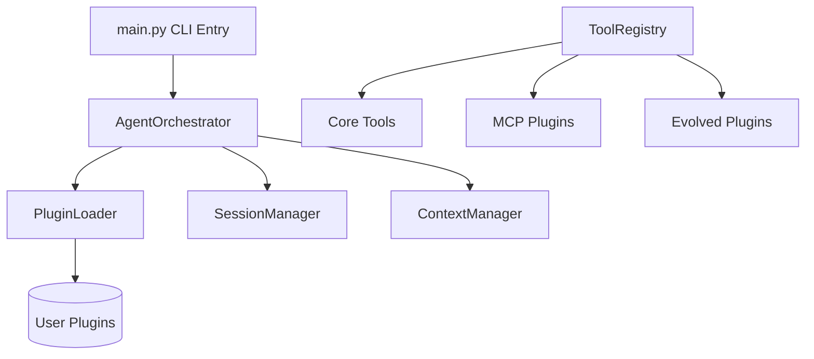

# mentask — Development Roadmap

> **Last Updated:** April 26, 2026
> **Current Version:** `0.20.0`
> **Maintainer:** [@julesklord](https://github.com/julesklord)
> **Status:**

This document outlines the engineering roadmap for `mentask`, organized into prioritized milestones. The current focus is on **Level 4 Autonomy** through self-evolving tools and deep codebase understanding.

---

## Current State Assessment

### What mentask v0.20.0 Can Do Today

| Capability | Status | Description |
| :--- | :--- | :--- |
| **Self-Evolving Tooling** | ✅ Shipped | Autonomous tool forging and hot-reloading (`forge_plugin`). |
| **3-Layer Architecture** | ✅ Shipped | Decoupled hierarchy (Core, MCP, User Plugins). |
| **Multimodal Reasoning** | ✅ Shipped | Processes images, audio, and video via base64 encoding. |
| **Autonomous Orchestration** | ✅ Shipped | Advanced Think -> Act -> Observe loop with 429 retry logic. |
| **TrustManager Security** | ✅ Shipped | Recursive directory validation and Path Traversal prevention. |
| **Web Research** | ✅ Shipped | Live internet search (Google/DDG) and content extraction. |
| **Autonomous LSP** | ✅ Shipped | Real-time verification and self-correction via Ruff LSP. |
| **Professional TUI** | ✅ Shipped | Persistent Gem-style CLI renderer with committed buffer. |
| **Cognitive Tools** | ✅ Shipped | Working Memory and Plan Checkpointing for multi-turn sessions. |

### Architecture Diagram



---

## Milestone 8: Multi-Model Sovereignty (COMPLETED)

- [x] Universal Provider Architecture (Gemini, OpenAI, DeepSeek).
- [x] models.dev Dispatcher Integration.
- [x] Persistent session history across providers.

## Milestone 9: Level 4 Autonomy ("The Spice Must Flow")

**Theme:** Transition from a static agent to a self-evolving engineering organism.

- [x] **Forge Engine**: Autonomous creation of Python-based tools.
- [x] **Hot-Reloading Registry**: Dynamic tool injection without session reset.
- [x] **3-Layer Plugin Security**: Granular access control for agent-forged tools.
- [ ] **Adaptive Identity**: Agent auto-updates its `identity.md` based on forged capabilities.

---

## Milestone 10: Scalable Memory & Intelligence ("Shai-Hulud")

**Priority:** 🔴 High
**Estimated Effort:** Q2 2026
**Theme:** Transition to vector-based memory and deep code understanding.

- [ ] **Vector Memory Integration**: Local RAG for codebase indexing.
- [ ] **Syntax-Aware Navigation**: Identifying classes/methods without full file reads.
- [ ] **Verification-First Editing**: Generating tests before applying changes.

---

## Version Release Timeline

```text
2026-04-19  v0.15.0  -  Kwisatz Haderach: LSP integration
2026-04-20  v0.16.0  -  The Golden Path: Professional Consolidation
2026-04-24  v0.18.0  -  Lisan al-Gaib: Cognitive Architecture
2026-04-26  v0.19.0  -  Water of Life: Universal Provider
2026-04-26  v0.20.0  -  The Spice Must Flow: Level 4 Autonomy (CURRENT)
```

---
*The code must be stable before the feature set expands.*
