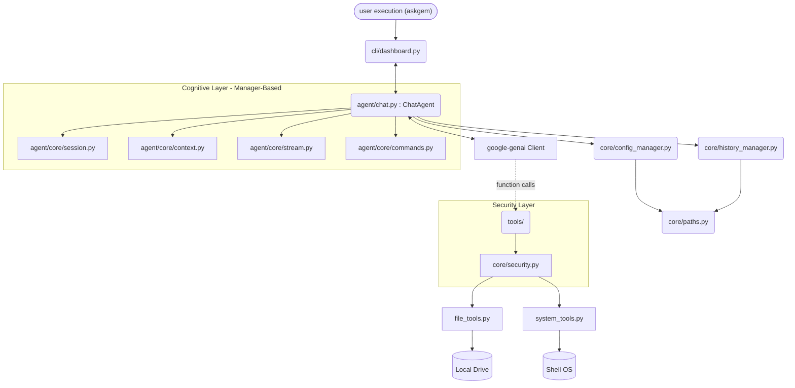

# Architecture

The system operates across three tightly decoupled layers enforcing strong logical boundaries. As of version **0.10.0**, the Cognitive Layer has been further modularized into specialized manager components.

## High-Level System Diagram

## Module Breakdown

1. **`src/askgem/cli/` (Presentation Layer)**
    * `dashboard.py`: **[v0.10.0]** Stable "Push-Layout" Textual interface optimized for Windows high-performance rendering.
    * `console.py`: Re-usable Rich console formatter singleton.
    * `ui_adapters.py`: Bridges TUI components with agent-level tool loggers.

2. **`src/askgem/agent/` (Cognitive Layer)**
    * `chat.py`: The central orchestrator coordinating manager logic.
    * **`agent/core/` [New in v0.10.0]**
        * `session.py`: Handles API initialization, exponential backoff, and simulation modes.
        * `context.py`: Dynamic assembly of system instructions and proactive history summarization.
        * `stream.py`: High-speed SDK generator parsing and tool extraction.
        * `commands.py`: Extensible slash-command dispatcher.
        * `simulation.py`: Deterministic playback/recording engine for core logic verification.

3. **`src/askgem/core/` (State Management & Safety)**
    * `security.py`: **[v0.10.0]** Hardened risk analysis engine categorizing command safety levels.
    * `paths.py`: Root level mapping resolving circular imports for disk storage endpoints (`~/.askgem`).
    * `config_manager.py`: Extracts and persists API keys and configurations (`settings.json`).
    * `history_manager.py`: Caches, truncates, and serializes contexts per chat session.
    * `metrics.py`: Real-time token tracking and cost estimation.
    * `i18n.py`: Locale autodetection.

4. **`src/askgem/tools/` (Agentic Tools)**
    * Isolated stateless execution tools the model mounts dynamically (file edits, OS bash reads).

## Execution Flow (v0.10.0 Hardened)

1. User enters `askgem`.
2. `cli/dashboard.py` initializes the TUI environment and triggers `ChatAgent`.
3. `SessionManager` boots configs, validating keys via system keyring or env vars.
4. `ContextManager` injects English-standardized instructions containing OS context, Persistent Memory, and Active Missions.
5. User inputs prompt. `StreamProcessor` consumes async chunks.
6. Detected `function_calls` pass through `core/security.py` for risk categorization (`SAFE` to `DANGEROUS`).
7. Results append to model loop context recursively. `TokenTracker` updates cost metrics.
8. Session history is proactively summarized by `ContextManager` if window limits are approached.

## Key Design Decisions

* **Decoupled Paths:** `core/paths.py` was separated explicitly to allow logging, history, and config components to query the host OS environment without engaging in circular imports.
* **Modular Cognitive Core:** Decentralizing `ChatAgent` into specialized managers in v0.10.0 was driven by the need for deterministic testing via `SimulationManager` and improved async lifecycle stability.
* **Security Middleware:** All tool invocations are now gated by a centralized security layer to prevent path traversal and accidental execution of high-risk shell patterns.
