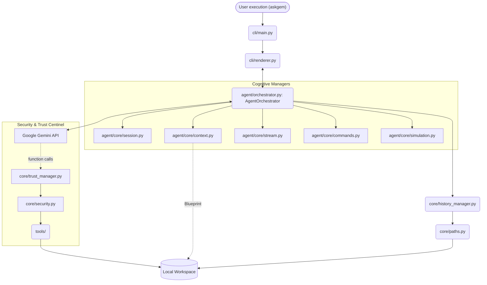

# Architecture

The system operate across three tightly decoupled layers enforcing strong logical boundaries. As of version **0.11.0**, the system has evolved into an **Orchestrated Architecture**, where a central engine manages cognitive managers and security centinels.

## High-Level System Diagram

## Module Breakdown

1. **`src/askgem/cli/` (Presentation Layer)**
    * `main.py`: Entry point for session orchestration and environment boot.
    * `renderer.py`: **[v0.11.0]** Advanced TUI renderer handling interactive prompts and streaming Markdown.

2. **`src/askgem/agent/` (Orchestration Layer)**
    * `orchestrator.py`: **[The Heart]** Central loop managing the *Thinking -> Action -> Observation* cycle.
    * **`agent/core/` (Cognitive Managers)**
        * `session.py`: Handles API lifecycle, retries, and key management.
        * `context.py`: **[Blueprint Aware]** Performs project scans and assembles system prompts.
        * `stream.py`: Low-level tool extraction from the GRPC stream.
        * `commands.py`: Dispatcher for slash commands (e.g., `/trust`).

3. **`src/askgem/core/` (State & Safety Layer)**
    * `trust_manager.py`: **[v0.11.0]** Whitelist management for authorized directories.
    * `security.py`: Real-time risk analysis and path resolution guards.
    * `paths.py`: **[Workspace Aware]** Maps dynamic local `.askgem/` vs global configuration.
    * `metrics.py`: Token consumption and cost tracking.

## Execution Flow (v0.11.0 Orchestrated)

1. **Environmental Boot**: `cli/main.py` detects if the CWD is a Workspace.
2. **Project Blueprint**: `ContextManager` performs a recursive scan of the project tree.
3. **Orchestrator Initialization**: `AgentOrchestrator` takes the Blueprint and starts the cognitive loop.
4. **Thinking Phase**: Gemini reasons about the request using the injected project context.
5. **Action Request**: If a tool is requested, `TrustManager` verifies the target path.
6. **Observation Loop**: Tool output is fed back to the Orchestrator to confirm the result before replying.
7. **Persistence**: History and Memory are saved within the local `.askgem/` directory.

## Key Design Decisions

* **Orchestration vs Interaction**: In v0.11.0, reasoning logic was separated from the UI. The `AgentOrchestrator` can run headless, while `renderer.py` only handles the display.
* **Proactive Context**: Instead of waiting for the user to describe files, the **Blueprint** system provides the agent with an initial mental map of the repository.
* **Trusted Containment**: All file operations are now gated by a dual-check: **Trust** (directory authorization) and **Security** (pattern risk analysis).
