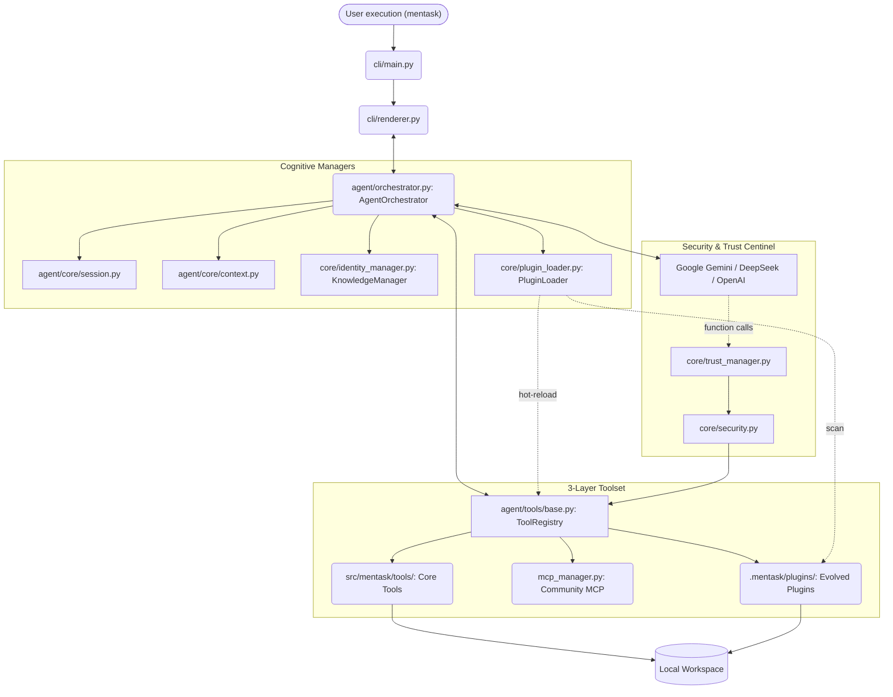

# Architecture

The system operates across three tightly decoupled layers enforcing strong logical boundaries. As of version **0.20.0 (The Spice Must Flow)**, the system has evolved into a **Self-Evolving Orchestrated Architecture**, where the agent can autonomously expand its own toolset via dynamic plugins.

## High-Level System Diagram

## Module Breakdown

1. `src/mentask/cli/` **(Presentation Layer)**

   - `renderer.py`: Persistent Gem-style renderer with incremental buffer commits.

2. `src/mentask/agent/` **(Orchestration Layer)**

   - `orchestrator.py`: **\[The Heart\]** Central loop managing the *Thinking -&gt; Action -&gt; Observation* cycle.
   - `tools/plugin_tools.py`: **\[The Forge\]** Contains `ForgePluginTool`, which allows the agent to write and register new Python tools.

3. `src/mentask/core/` **(Safety & Evolution Layer)**

   - `plugin_loader.py`: **\[The Evolver\]** Handles dynamic `importlib` logic to inject new tools into the registry at runtime.
   - `security.py`: **\[The Guard\]** Validates paths and commands. Specifically tuned to allow agent-forged modifications in the `plugins/` directory.
   - `paths.py`: Resolves hierarchical paths for global config, local workspaces, and the new plugin incubator.

## Execution Flow (v0.20.0 Evolving)

1. **Environmental Boot**: `cli/main.py` initializes the environment.
2. **Dynamic Discovery**: `PluginLoader` scans the local and global plugin directories and injects any `BaseTool` subclasses into the `ToolRegistry`.
3. **Cognitive Loop**: The LLM reasons about the task.
4. **Autonomous Forging**: If the LLM identifies a repetitive or specialized task, it uses `forge_plugin` to architect a new native tool.
5. **Hot-Reload**: The `PluginLoader` immediately instantiates and registers the new tool, making it available for the next turn in the same session.

## Key Design Decisions

- **Level 4 Autonomy**: The agent is no longer a static consumer of tools; it is an active producer of engineering specialized plugins.
- **Separation of Concerns**: Core tools remain immutable. Evolved tools are isolated in `.mentask/plugins/` to prevent source code pollution and merge conflicts during updates.
- **Verification-First Forging**: The Forge engine uses `ast.parse` to validate the syntax of generated plugins before commitment.
